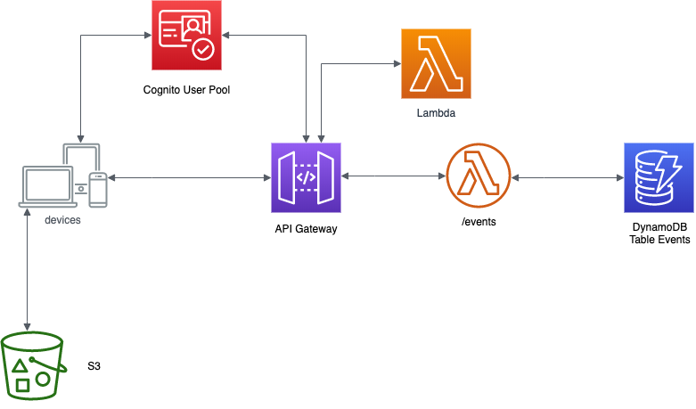
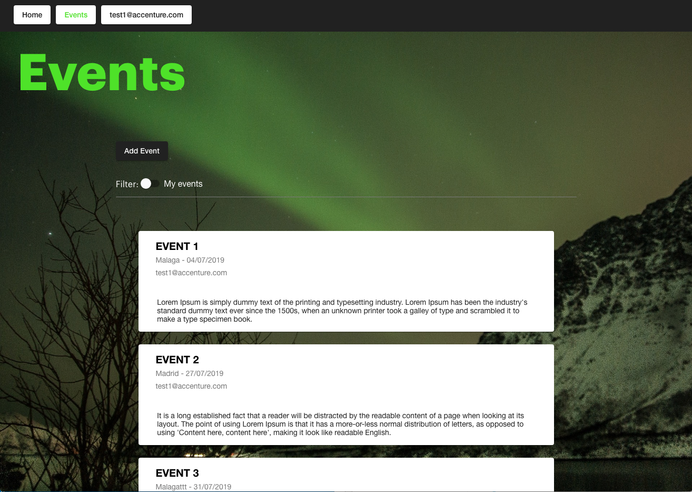

    

# Openathon VI - Serverless with AWS :rocket:

## ¡¡Bienvenido al Openathon VI!!

En esta edición vamos a descubrir las características y funcionamiento de algunos de los servicios web de Amazon y particularmente aquellos que nos permiten desplegar y ejecutar aplicaciones en la nube sin necesidad de reservar o administrar ningún tipo de servidor. Este enfoque se encuadra en las soluciones conocidas como [Serverless](https://aws.amazon.com/es/serverless/), que cada día son más populares y que se están convirtiendo en un alternativa muy atractiva a los enfoques tradicionales, donde es necesario disponer de servidores, ya sea físicos o virtuales, que es necesario adquirir y administrar.

[Amazon Web Services](https://aws.amazon.com/es/what-is-aws/), o de manera abreviada **AWS**, es un conjunto de servicios implementados y ofrecidos por Amazon en el marco de la *cloud computing*. **AWS Lambda** es uno de estos servicios y permite disponer de funciones para atender a diversos tipos de eventos sin tener que provisionar o adminitrar ningún tipo de servidor. El coste de estos servicios depende únicamente del tiempo de proceso que se consuma en su ejecución. En este Openathon, vamos a utilizar este servicio para dotar a nuestra aplicación basada en eventos de la lógica necesaria para su ejecución.

Al final de este Openathon, tendrás la siguiente arquitectura serveless completamente funcional:

    

Los servicios que utilizaremos serán:

1. **DynamoDB**. Servicio de base de datos no sql.
2. **IAM (Identity and Access Management)**. Servicio para el control del acceso al resto de servicios.
3. **S3**. Servicio de almacenamiento para publicar la aplicación Angular y contener las funciones lambda si las implementas en Java.
4. **Cognito**. Servicio de autenticación de usuarios.
5. **Lambda Functions**. Funciones de negocio.
6. **API Gateway**. Gestiona las API REST que darán acceso controlado a las funciones Lambda.

El índice del contenido es el siguiente:

1. [Introducción a Cloud-native, Serverless y Serverless en AWS](/introduction)
2. [LAB 0. Pasos iniciales: Seguridad y Utilidades](/lab-00)
3. [LAB 1. DynamoDB](/lab-01)
4. [LAB 2. IAM: Creación de roles](/lab-02)
5. [LAB 3. Crear función lambda: Events-List](/lab-03)
6. [LAB 4. Crear API Gateway](/lab-04)
7. [LAB 5. Cognito](/lab-05)
8. [LAB 6. Securizar Get /events](/lab-06)
9. [LAB 7. Finalizar la configuración del API Gateway](/lab-07)
10. [LAB 8. Publicar la web en S3](/lab-08)

Para la realización de los laboratorios, los participantes dispondrán de un usuario de formación con acceso a los servicios necesarios. Adicionalmente podrán también crearse su propia cuenta y gestionar los usuarios y los recursos necesarios para hacerlo. Las funciones lambda se presentan tanto en java como en python para que cada participante pueda utilizar el lenguaje que prefiera.

## Visión General de la Aplicación

Los trabajos los realizaremos sobre la aplicación "Events" que ya iniciamos en el IV Openathon dedicado a [Angular](https://github.com/Accenture/openathon-2019-angular). Nuestra aplicación nos permite crear y gestionar eventos. En ella, después de logarnos, podremos crear nuevos eventos, consultar los existentes, filtrar los que hemos generado nosotros...

    

En este Openathon completaremos esta aplicación con los componentes necesarios para dotarla de seguridad y hacer que sea accesible desde internet.

Vamos por tanto a:

* Añadir persistencia a la aplicación usando **DynamoDB**.
* Proporcionarle un backend mediante **Lambda** y **API Gateway**.
* Dotarla de seguridad con **Cognito** e **IAM**.
* Hacerla accesible usando **S3**.

Pero primero vamos a introducir el significado del enfoque serverless.

[Introducción >](/introduction)

    

