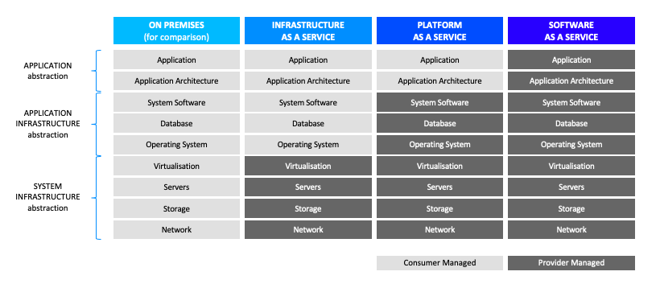
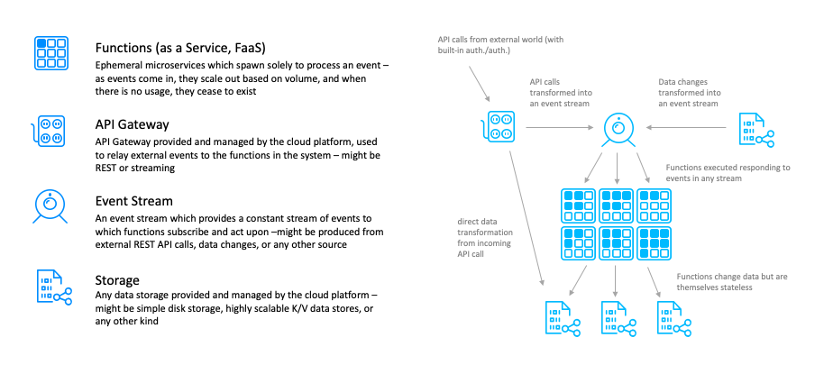

    

# Introducción a Cloud-native, Serverless y Serverless en AWS

## Conceptos básicos

En este Openathon VI vamos a evolucionar la arquitectura de la solución respecto a la utilizada en los anteriores, explorando una nueva forma de soluciones web. Aprovechando todo lo ya aprendido -frontends JavaScript modernos, backends Java cloud-native con microservicios, containerización con Docker- vamos a ir más allá y aprenderemos sobre el máximo nivel de abstracción posible hoy en día, con tecnologías nativas de la nube: el enfoque serverless.

Comenzaremos introduciendo el concepto de cloud-native y los distintos niveles de abstracción que nos encontramos en modelos cloud. También describiremos las características fundamentales de una arquitectura serverless y haremos un pequeño repaso a los principales servicios serverless en Amazon Web Services (AWS).

## Introducción breve a Cloud-native

Comencemos hablando de qué significa Cloud-native, es decir qué significa ser nativos de la nube.

Cloud-native es un nuevo enfoque de arquitectura para el diseño, construcción y operación de aplicaciones modernas que necesitan adaptarse a un panorama tecnológico de cambio constante y veloz, y condiciones cada vez más desafiantes para los negocios.

Las aplicaciones nativas de la nube, <i>*cloud-native applications*, son aquéllas que se ejecutan sobre plataformas nativas de la nube, típicamente multi-tenant, que se construyen sobre y consumen servicios nativos proporcionados y gestionados por los proveedores de cloud.

Es decir: en lugar de montar un servidor en la nube y sobre él instalar un sistema operativo, un servidor web o una base de datos, consumimos un servicio que encontramos en el catálogo de un proveedor y que nos proporciona las capacidades que necesitemos (web, base de datos u otras), sin tener que preocuparnos de gestionar máquinas, discos o redes, o cómo se gestionan los accesos, se exponen a Internet o se otorgan permisos. Se establecen las necesidades y las políticas, y es el proveedor de nube quién se encarga del resto.

Además, las aplicaciones cloud-native se desarrollan con procesos de ciclo de vida del desarrollo que también son cloud-native, con herramientas especialmente adaptadas a este enfoque.

Es decir: en lugar de montar un repositorio de código o un servidor de integración continua sobre máquinas en la cloud, contratamos el servicio que el vendedor gestiona y que a partir de ese momento consumimos sin tener que preocuparnos de qué recursos de computación necesita, cuál es la configuración de servidores, ni de mantener al día las versiones y parches necesarios para mantener estable y saludable todo el entorno.

Un ejemplo de lo anterior es, por ejemplo, una aplicación que utiliza GitHub como plataforma de ciclo de vida, TravisCI para la integración continua y automatización de los despliegues, que se hacen sobre Amazon Web Services con los servicios Lambda, CloudFront, ElastiCache, y DynamoDB.

Desde un punto de vista de arquitectura, las aplicaciones nativas para la nube se basan sólidamente en prácticas de Agilidad (*Agile*) y DevOps, y se adhieren a principios de diseño tales como: el manifiesto de la aplicación de 12 factores, microservicios, contenedores o serverless.

## Niveles de abstracción: IaaS, PaaS, CaaS y FaaS

Dentro del mundo cloud existen diferentes niveles de abstracción en función de qué servicios son gestionados directamente por el proveedor cloud y cuáles no. Los tres modelos principales 'clásicos' son: IaaS, PaaS y SaaS; respectivamente: infraestructura como servicio, plataforma como servicio y software como servicio. Estos niveles de abstracción se describen gráficamente con un diagrama de capas como el que enseñamos a continuación:

El enfoque IaaS es lo que también se conoce como <i>*lift & shift*. Sobre la base de recursos de computación virtualizados se construye la infraestructura como un modelo 1:1 de la infraestructura <i>on-premise</i> original. Los bloques de trabajo son servidores, CPU, memoria, discos, adaptadores de red, firewalls, igual que en la infraestructura tradicional. En un enfoque IaaS no se aprovecha todo el potencial de la nube ya que aunque es un enfoque más elástico y que permite abrazar modelos de pago por uso, el grano de la abstracción es muy grueso y no gestiona (ni particiona) más allá del servidor o del disco.

El enfoque que más aprovecha el potencial de la cloud es el de plataforma como servicio: el proveedor da un paso más allá y abstrae aspectos básicos como pueden ser el sistema operativo (actualizaciones, parches), la instalación de una base de datos o las librerías de sistema necesarias para que funcionen las aplicaciones (p.ej. la JVM, los runtime de Node.js o Python, librerías nativas para ejecutar binarios de Go o Rust, etc.).

Sin embargo, en la actualidad este modelo se queda corto ya que dentro del espectro de plataformas como servicio existen niveles de abstracción aún mayores que nos permiten a los desarrolladores centrarnos en las aplicaciones y la lógica de negocio, dejando en las manos del proveedor la gestión de una parte significativa de la arquitectura de aplicación.

Existen dos modelos de abstracción fundamentales complementando al modelo PaaS: CaaS (contenedores como servicio) y FaaS (funciones como servicio).

### CaaS - Contenedores como servicio

En el modelo CaaS, el proveedor gestiona una plataforma de contenedores que permite la ejecución de múltiples aplicaciones, de tamaños y tecnologías muy variadas, sobre un pool de recursos de computación que se abstraen al usuario de un CaaS. La unidad de abstracción es, obviamente, el contenedor. Gran parte de la <i>outer architecture</i> está abstraida, como pueden ser las capacidades de registro y descubrimiento de servicios, métricas y logs, enrutamiento, seguridad, etc.

Cuando se utiliza un CaaS, como aprendimos en la Openathon V con Docker, construimos las aplicaciones como conjuntos de contenedores que colaboran entre sí, y ejecutamos dichos contenedores con sus reglas de acceso, enrutado o escalado. Cómo consigue la plataforma contar con los recursos de computación necesarios para ejecutar las aplicaciones containerizadas, cómo se encarga de que una petición llegue al lugar esperado y se devuelva una respuesta si la hay, o cómo escala una aplicación para ajustarse a las necesidades del momento, es totalmente transparente a los arquitectos y desarrolladores de la aplicación.

El modelo CaaS, como podemos ver, no hace ningún tipo de asunción al respecto del tamaño de las aplicaciones containerizadas. Es decir, CaaS no implica necesariamente microservicios.

### FaaS - Funciones como servicio

En el modelo FaaS, sin embargo, sí que se hace una asunción fundamental al respecto de la unidad de trabajo. Se descompone la lógica de aplicación más allá de los microservicios llegando al nivel de funciones individuales. Dada una función (típicamente escrita en un lenguaje como Java, JavaScript, Python o C#), junto a sus dependencias, la plataforma se encarga de containerizarla, ejecutarla de forma segura, hacerla accesible a clientes y otras funciones, monitorizarla y escalarla.

Existen tanto tecnologías propietarias como AWS Lambda, como tecnologías de código abierto como OpenWhisk o Knative.

A nivel de escala, una aplicación que se descomponga en decenas de microservicios, incluso cientos de ellos, se podrá descomponer a su vez en cientos, incluso miles, de funciones.

## Introducción a Serverless

Entonces: ¿qué es serverless? Serverless es un estilo de arquitectura cloud-native en el que todos los componentes del sistema se ejecutan sobre recursos abstraídos y gestionados completamente por el proveedor cloud, de forma unificada e integrada como si de una nueva plataforma se tratara.

Serverless incluye FaaS, pero el modelo incluye a muchas otras abstracciones: bases de datos, almacenamiento, APIs, colas de mensajes, servicios de notificación y muchos otros. Serverless aplica a cualquier componente en la arquitectura de una aplicación.

Existen servidores, por supuesto, y recursos de computación, pero no son visibles al usuario del serverless. Esto simplifica enormemente la definición, aprovisionamiento, despliegue y operación de las aplicaciones, como veremos a lo largo de este Openathon.

Además, como la mayor parte de los requerimientos no funcionales y la <i>*outer architecture*</i> están abstraídos, el código de las aplicaciones es mucho más limpio, enfocado en la lógica de negocio.

Son arquitecturas mucho más seguras, ya que tienen una superficie de ataque mucho menor, en la que no se exponen los recursos de la plataforma sobre la que se ejecutan las aplicaciones.

Finalmente, los modelos serverless exprimen al máximo el modelo de pago por uso, con tablas de precios que llegan al grano más fino posible: número de veces que invocas a una API, tiempo en milisegundos que se ejecuta una función, número de veces que ejecutas una query, número de mensajes que publicas a una cola, etc.

## Servicios Serverless en AWS

El número de servicios serverless en Amazon Web Services es amplio y crece de forma constante. En este Openathon vamos a utilizar los más habituales en arquitecturas de soluciones web:

- *Lambda*: Servicio de funciones para la lógica de negocio y con capacidades de procesamiento por eventos, <i>streaming</i> e integración entre fuentes de datos.
- *DynamoDB*: Base de datos NoSQL que soporta almacenes de tipo clave-valor y documentales.
- *API Gateway*: Servicio de gestión de APIs.
- *S3*: Servicio de almacenamiento que modela los sistemas de archivos en abstracciones llamadas <i>buckets</i>.
- *Cognito*: Servicio de autentificación de usuarios.

Combinando estos servicios serverless podemos construir y operar completamente aplicaciones de toda índole, sin 'tocar ni un solo servidor', íntegramente con servicios gestionados por el proveedor (AWS en este caso).

## Conclusión

Una vez conocidos los conceptos básicos en el modelo serverless, sus principales ventajas y, en particular, qué servicios vamos a utilizar, iremos avanzando, con la ayuda de los laboratorios prácticos, en la construcción paso a paso de una aplicación completa con front, api, back, datos y seguridad.

[< Página principal ](../README.md)  | [Lab 00 >](../lab-00)

    

