# Laboratorio 0 - Pasos iniciales: Seguridad y Utilidades

## Contenido

En este capítulo trataremos dos prerequisitos para poder realizar el resto de los laboratorios:

- El usuario de acceso para crear los servicios.
- Las herramientas utilizadas en las actividades.

## Usuario Formación Accenture/AWS

Para poder utilizar AWS es necesario disponer de un usuario con las autorizaciones necesarias para hacerlo. A los asistentes a este Openathon se les proveerá de un usuario en la cuenta de formación de Accenture, que dispondrá de dichas autorizaciones. Si te has inscrito, deberías haber recibido un correo con las creedenciales de dicho usuario, si no es así por favor contacta con los organizadores para que te lo hagan llegar.

Este usuario será eliminado al finalizar las actividades y por razones de seguridad realizará de manera limitada alguno de los laboratorios.

### ¿Cómo me conecto haciendo uso del usuario de formación?

Para acceder con nuestro usuario de formación, el enlace está en la Wiki del grupo de Teams.

Deberás acceder directamente, aunque si ya tenías un rol previo aparecerá una ventana de selección de rol. Seleccionaremos el rol DevOpenathon. Este es el rol que tendremos todos asignado.

    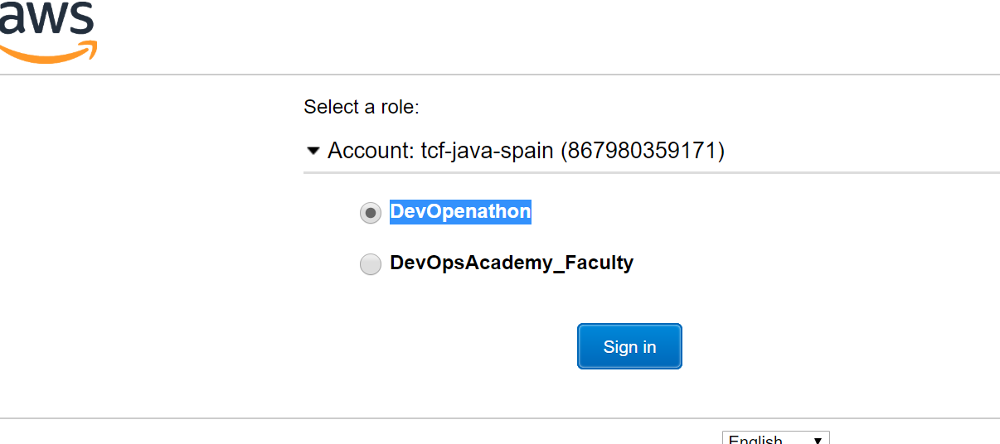

Una vez seleccionado el rol, accederemos a la consola de AWS con nuestro usuario.

    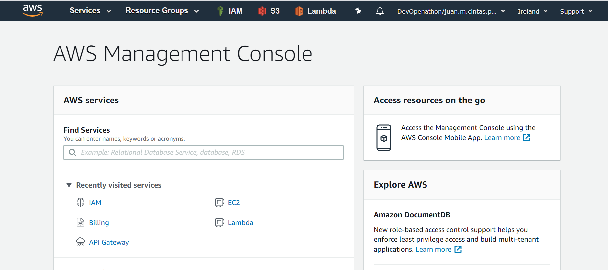

Esto es todo, ¡Ya podemos comenzar a realizar las prácticas!

## Usuario propio AWS

Aunque es perfectamente posible realizar y comprender todas las actividades con el usuario de formación, si los asistentes lo desean pueden darse de alta en AWS, lo que les permitirá el uso de la [capa gratuita de AWS](https://aws.amazon.com/es/free/?all-free-tier.sort-by=item.additionalFields.SortRank&all-free-tier.sort-order=asc), y por tanto el acceso completo y permanente a todos los servicios utilizados en este Openathon.

Utilizar un usuario propio de AWS supone asumir el control y administración de una cuenta REAL que puede incurrir en gastos REALES. Por ello es imprescindible establecer una serie de controles y limitaciones que lo impidan.

Para utilizar nuestra propia cuenta, por razones de seguridad crearemos dos usuarios:

- Usuario raíz. Usuario nominal con el que creamos la cuenta AWS, tiene acceso a todos los servicios sin limitación.
- Usuario IAM. Usuario creado desde el usuario raíz con un conjunto de permisos administrativos para acceder de manera limitada a los servicios de AWS. Como práctica recomendada, un usuario sólo debe acceder a aquellos servicios imprescindibles para realizar el trabajo que le es asignado (también conocido como principio de mínimos previlegios).

Así, una vez creado el usuario raíz y que éste halla creado el usuario IAM, todos las actividades del Openathon las realizaremos con este último.

A continuación explicamos paso a paso como:

1. Crear una cuenta raíz en AWS.
2. Control de gastos de la cuenta raíz.
3. Creación del usuario IAM.

### ¿Cómo se crea una cuenta raíz en AWS?

Aunque en la [web de ayuda de amazon](https://aws.amazon.com/premiumsupport/knowledge-center/create-and-activate-aws-account/) podemos encontrar información sobre los pasos a seguir para crear una cuenta, vamos a dar detalle sobre los mismos e intentar ampliar esa información.

Para crear una cuenta, será necesario abrir la página principal de [amazon webservices](https://aws.amazon.com/). En ella se hará clic sobre el enlace [Create an AWS account](https://portal.aws.amazon.com/gp/aws/developer/registration/index.html?nc2=h_ct&src=header_signup).

    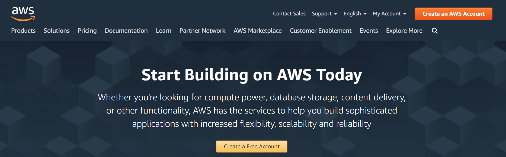

Será necesario informar los siguientes valores de la nueva cuenta:

    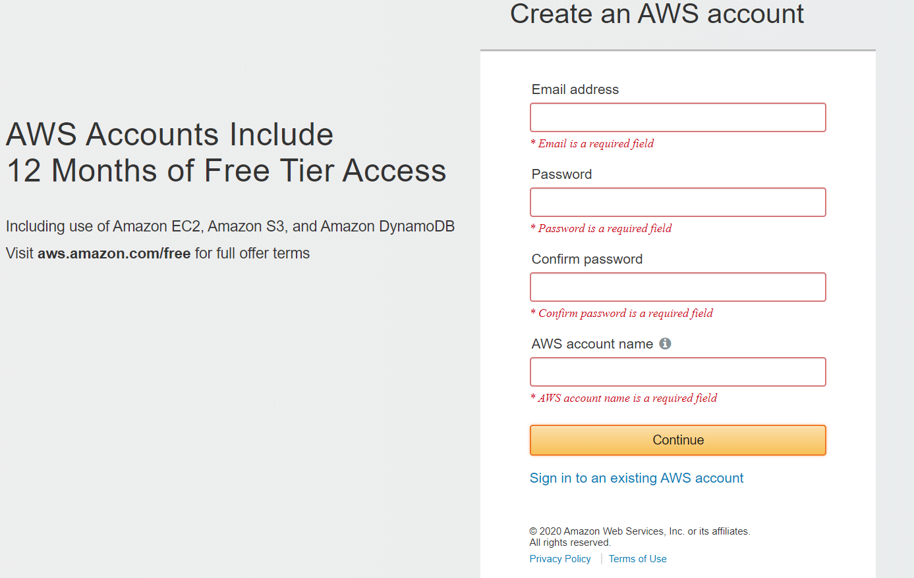

En la siguiente ventana se completarán los datos de contacto.

    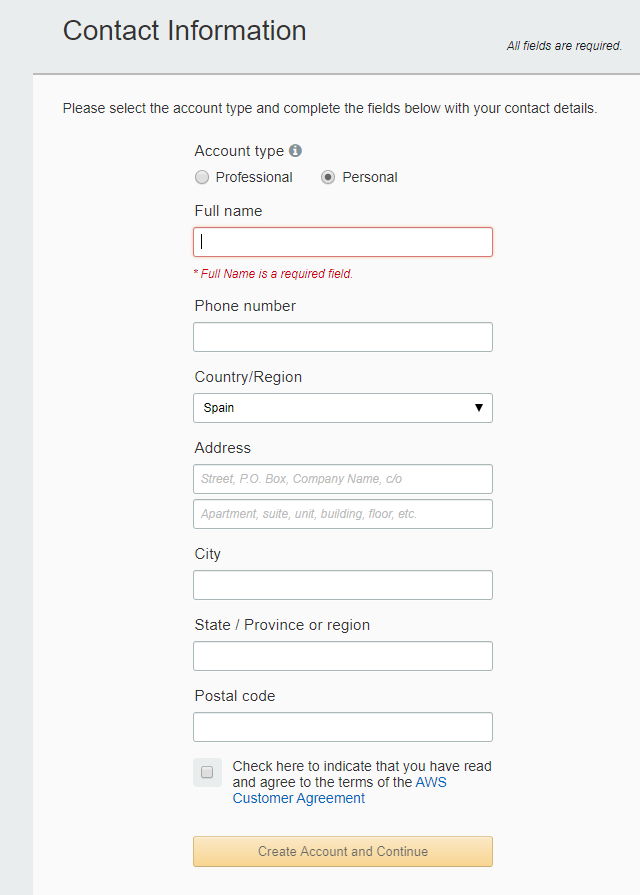

Lo siguiente será introducir los valores de pago. Hay que tener en cuenta que Amazon puede realizar un cobro de 1$ para verificar la tarjeta.

    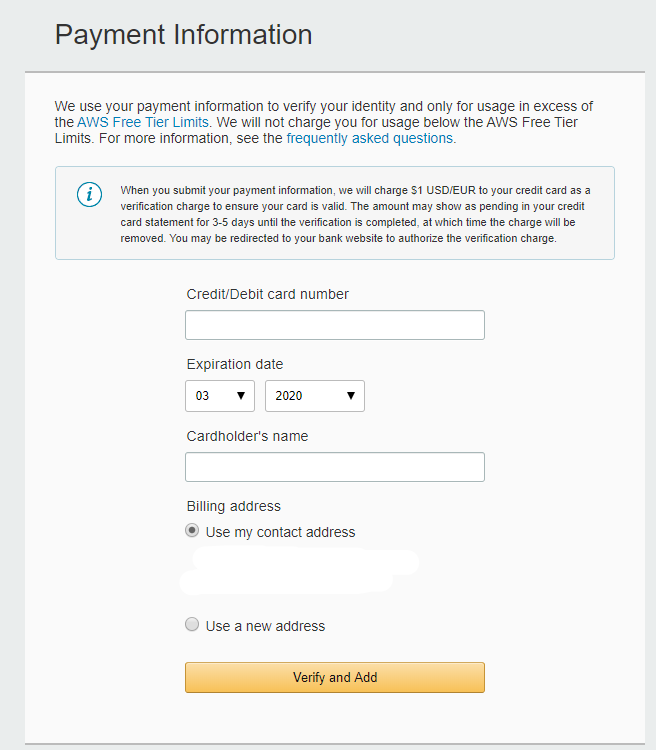

A continuación, es necesario validar el número de teléfono. Se podrá hacer mediante llamada telefónica o sms. Este paso nos permite verificar la identidad.

Finalmente seleccionaremos un plan, el plan básico.

    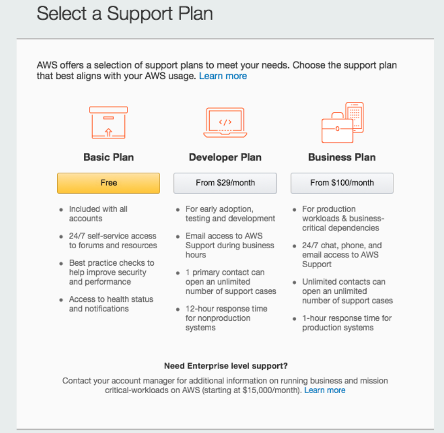

### Control de Gastos

Todos los servicios de los que vamos a hacer uso en esta Openathon están cubiertos en su totalidad por el *free tier* con unos límites de recursos gratuitos muy por encima de los requeridos por un ejercicio como éste.

Límites del *free tier* para los servicios usados:

- *Api Gateway*:  one million api calls per month (only first 12 months on free tier)
- *Lambda*: one million free requests per month and 400,000 GB-seconds of compute time per month (no time limit on free tier)
- *DynamoDB*: 25 Gb storage and 25 WCU and 25 RCU Capacity units. (no time limit on free tier)
- *S3*: 5 Gb storage, 20.000 get Requests 2.000 put requests (only first 12 months on free tier)

Podemos conocer el gasto que tenemos pendiente en nuestra cuenta y permitir recibir alertas sobre los mismos. Para ello accederemos como root en AWS y en el menú services escribiremos Billing.

    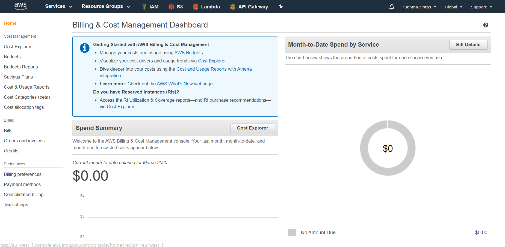

Localizaremos las secciones “Spend summary” y "Month-to-Date" y validaremos que son cero.

Adicionalmente, en el Menú Billing>Bills podemos ver un resumen de los servicios usados y su coste.

    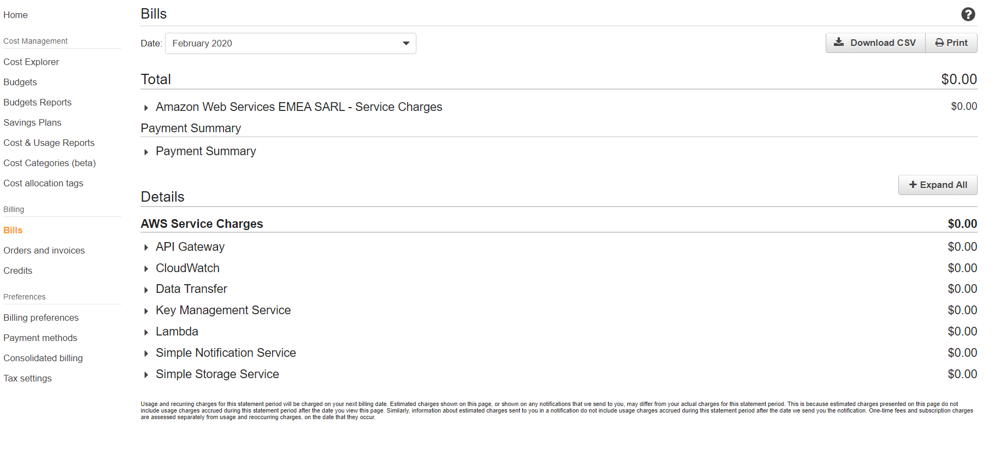

Si tuviésemos algún coste, podemos localizarlo viendo el menú Cost Managment>Cost Explorer.
En él podremos determinar que servicio está activo y generando costes y proceder como correponda(si no es necesario, es posible eliminarlo).

#### Alarma de Gastos

Adicionalmente, y para una mayor tranquilidad, Amazon posibilita la generación de alarmas de gastos. En este [enlace](https://docs.aws.amazon.com/AmazonCloudWatch/latest/monitoring/monitor_estimated_charges_with_cloudwatch.html) podemos encontrar detalle de como proceder.
Básicamente es necesario:

- Habilitar billing alerts.
- Crear billing alarm.

### Creación usuario IAM.

Lo primero que hay que hacer es acceder con nuestra nueva cuenta de AWS.

    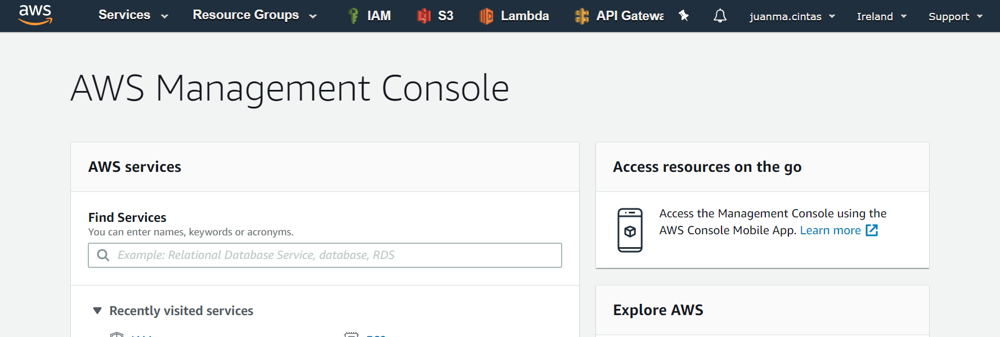

A continuación, haremos clic en el menú services y teclearemos IAM, seleccionando el servicio Identity and Access Management (IAM).

    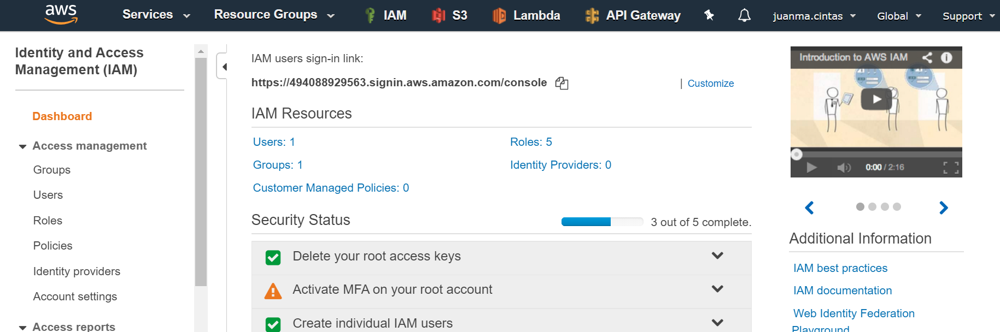

Sobre el menú de la izquierda, haremos clic sobre Users. No debemos tener ningún usuario creado todavía, por lo que vamos a proceder a crear uno, para ello se hace clic sobre Add User.
En la siguiente ventana informamos el nombre del usuario, marcamos las checks de Programmatic access y AWS Management Console access. También marcamos la opción de establecer nuestra password. Una vez se haya completado hacemos clic sobre Next:Permissions.

    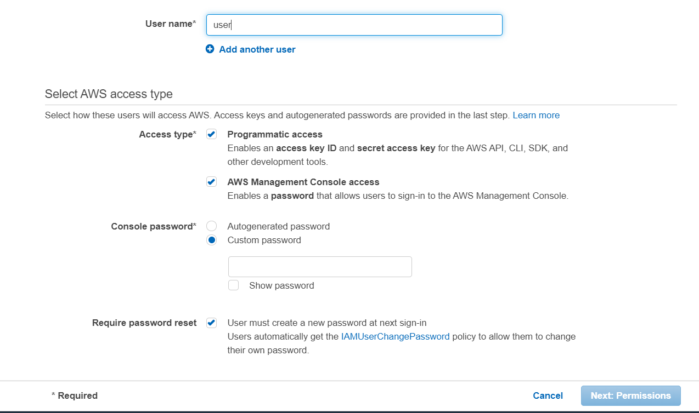

Lo siguiente será asignar este nuevo usuario a un grupo. Como no existe ningún grupo creado previamente clicamos sobre Create Group.
Como nombre de grupo introducimos developers. En las policies marcamos AdministratorAccess.

    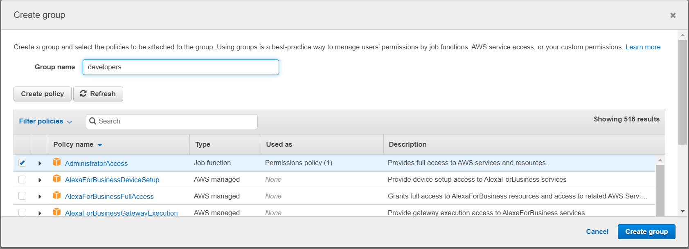

Con ello ya podemos hacer clic sobre Create group.

    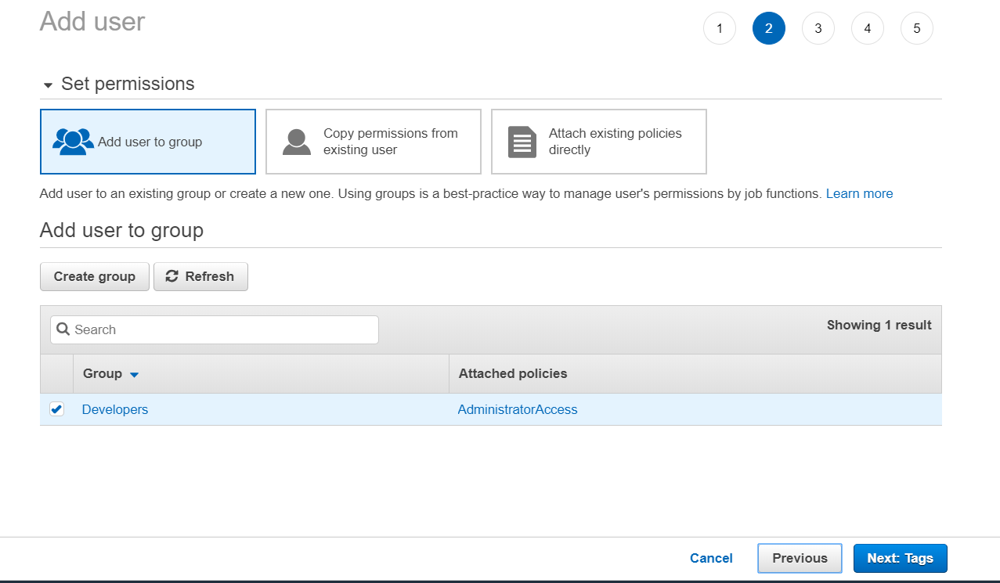

Podemos hacer clic sobre Next:Tags, donde podrán asignársele etiquetas.

    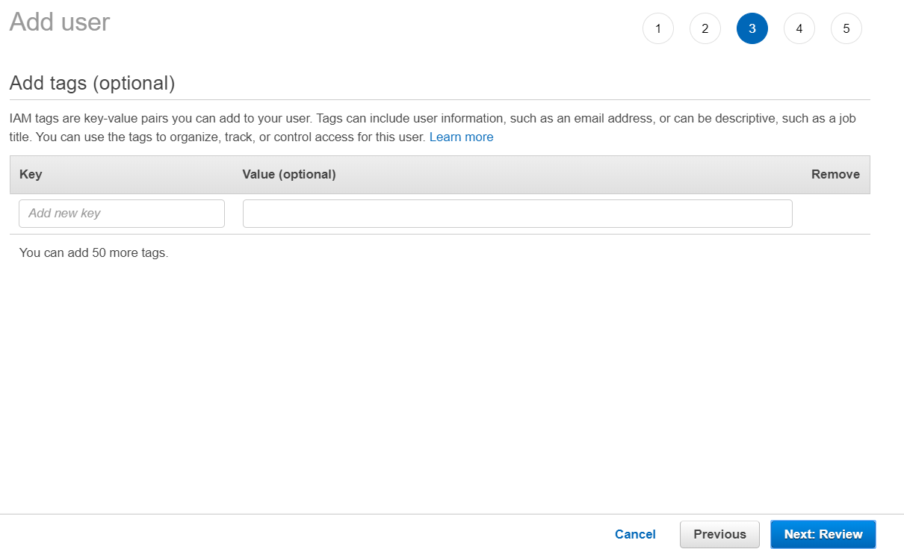

Y Next:Review donde se mostrará un resumen de nuestro nuevo usuario:

    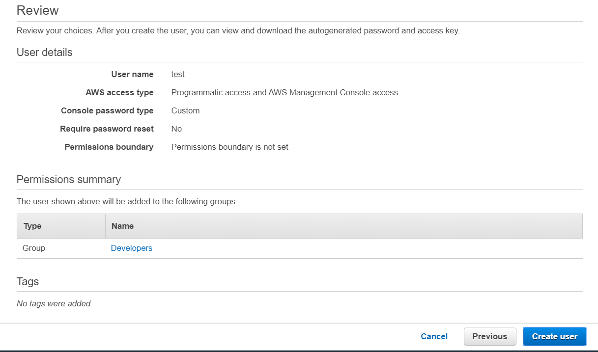

Finalmente, el usuario se ha creado. Si queréis hacer uso del plugin de eclipse, aws-cli, extensiones de Visual Studio Code, etc., puede ser buena idea hacer clic sobre download.csv para disponer de las credenciales y poder utilizarlas con alguna de estas herramientas.

    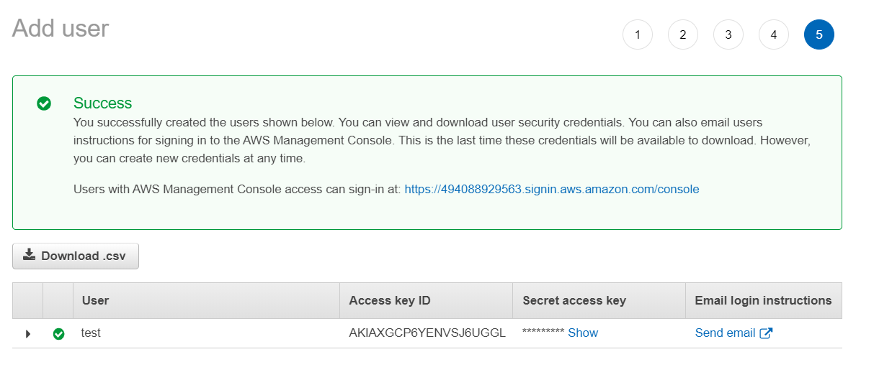

Para poder acceder ahora con nuestro nuevo usuario, podemos ir al usuario, en la pestaña Security Credentials tenemos una url con el acceso.

    

Al introducir esa url en el navegador, directamente tendremos nuestro id y username. Faltará introducir la password que establecimos al crear el usuario.

    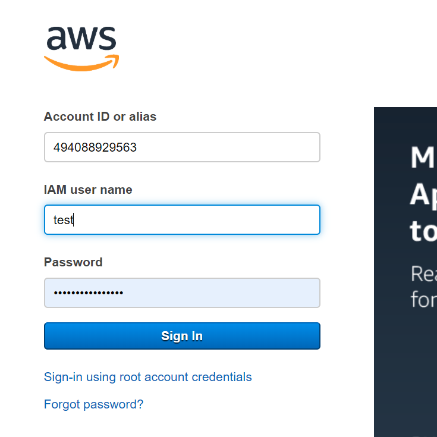

## Herramientas adicionales

### Postman

A lo largo del ejercicio, se crearán servicios que pueden ser consumidos vía REST. Para realizar pruebas sobre los mismos será necesario el uso de alguna aplicación (PostMan, JaSON, etc). Si no tienes ninguna instalada, aquí tienes una guía de como instalar Postman HTTP Client (qué también puedes usar desde la web o desde la extensión en Visual Studio Code):

Lo primero es abrir el navegador y acceder a la web de [postman](https://www.postman.com/).

    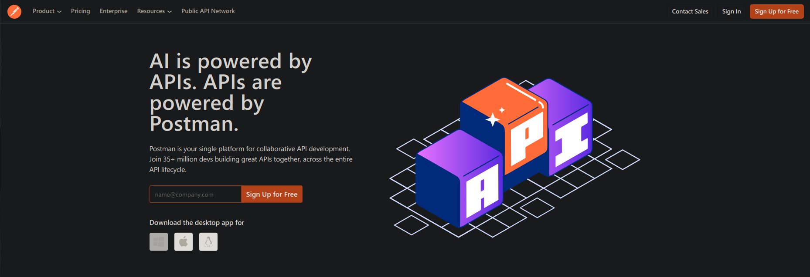

Seleccionar el botón de descarga correspondiente a tu sistema operativo.

Una vez descargada e instalada la aplicación, la primera vez solicitará la creación de un usuario. Esto es gratuito.

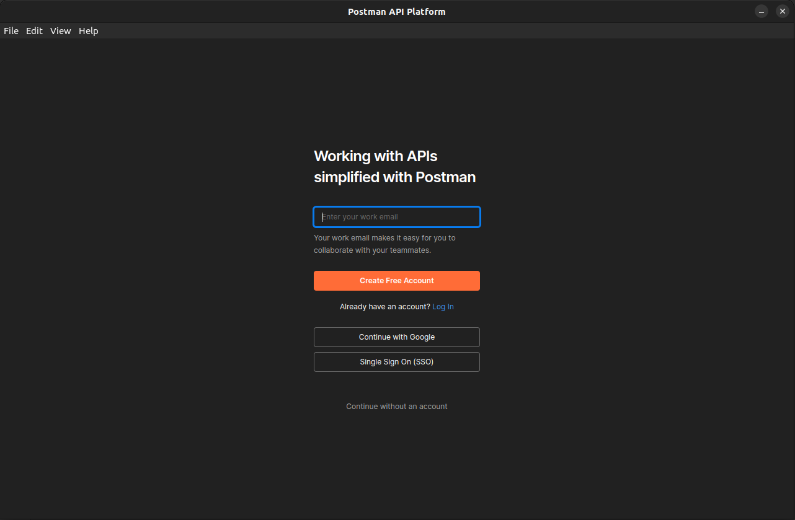

Una vez logado en la aplicación veremos lo siguiente:

    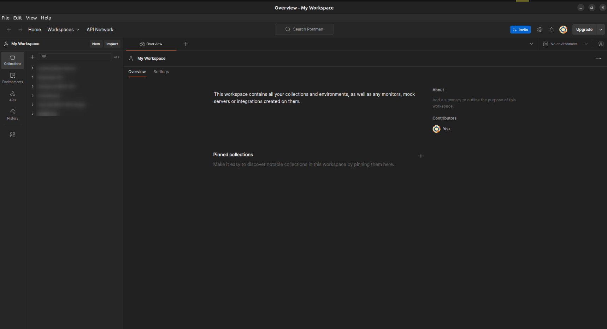

Aunque no es obligatorio, una buena práctica es comenzar creado una colección, para en ella crear todas las peticiones HTTP relacionadas con un proyecto.
Para ello, hacemos clic sobre New Collection, establecemos un nombre y volvemos a hacer clic sobre Create.

    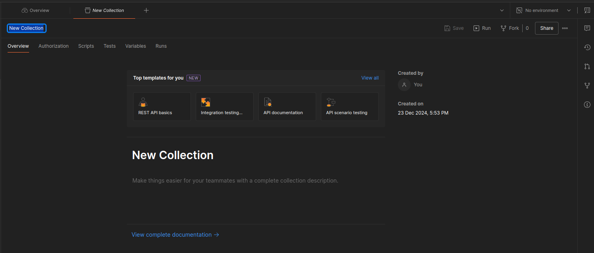

Para crear una Request(necesario para probar nuestras funciones lambdas a traves de la API) se hará clic sobre ... y Add Request.

    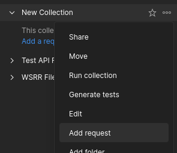

Será necesario establecer un nombre. Una vez hecho esto podremos determinar el tipo de petición, la url y los parámetros, autorización y
cabeceras. Para ejecutar la petición habrá que pulsar sobre el botón Send.

    

### AWS Toolkit for Eclipse

La implementación de las funciones lambda se puede realizar el python o en java. Si deseas hacerlo en este último lenguaje, será necesario que instales una serie de herramientas que te facilitarán el desarrollo.

Lo primero es descargar la última versión de eclipse.

A continuación tienes que el instalar el plugin de AWS Toolkit para eclipse. Para ello, desde el Marketplace de Eclipse escribiremos AWS.

    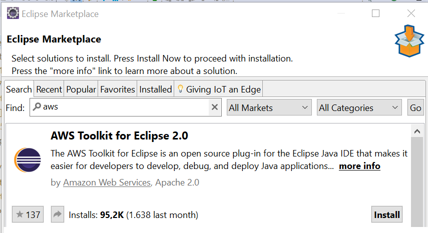

Para instalarlo bastará con hacer clic sorbre Install. En la siguiente ventana confirmaremos todos los componentes adicionales y aceptaremos las licencias. Cuando haya finalizado la instalación nos pedirá reiniciar Eclipse.

Al reinicar, se abrirá la ventana de configuración de AWS ToolKit, donde tendremos que configurar nuestra cuenta de AWS.

    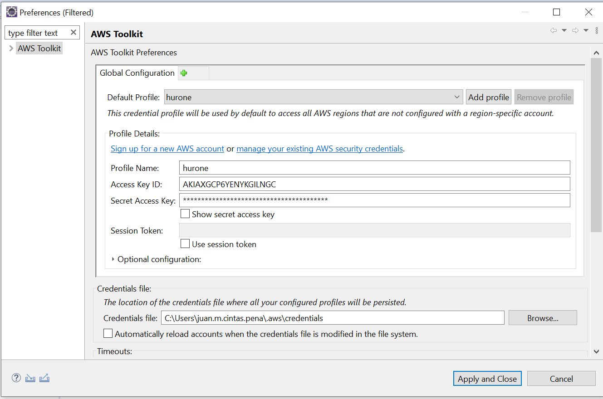

Si esta ventana no aparece, es posible abrirla desde el nuevo icono de AWS ToolKit for Eclipse, haciendo clic sobre el y seleccionando el menú Preferences.

    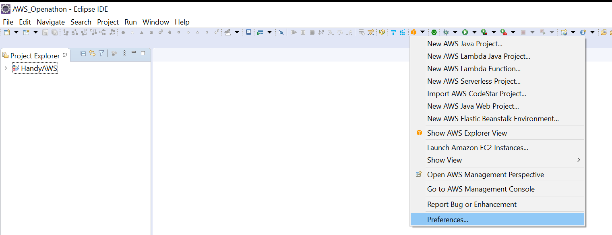

En esta ventana debemos informar los datos del usuario que realizará el upload de la función lambda a AWS. En el caso de utilizar la cuenta de formación, esta información habrá sido remitida a cada usuario por los organizadores. En el caso de utilizar la cuenta personal creada, se informará con los datos de nuestro usuario IAM creado(no root). Los datos de clave y secret pueden obtenerse del fichero download.csv que descargamos al crear el usuario.

[< Introducción ](../introduction)  | [Lab 01 >](../lab-01)
