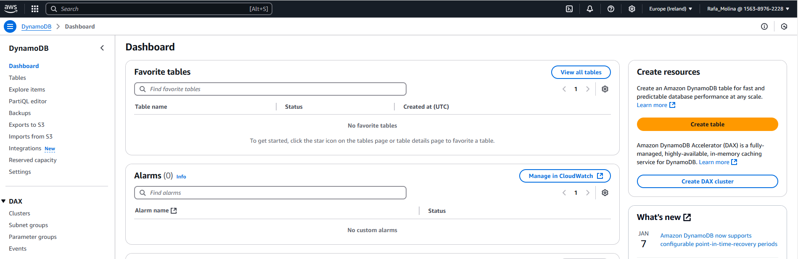
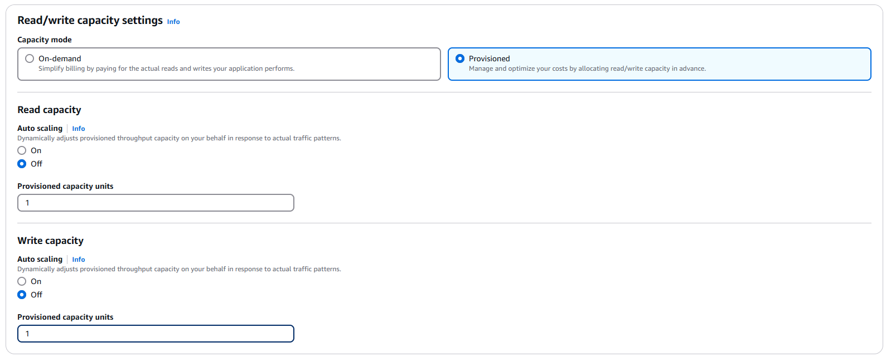
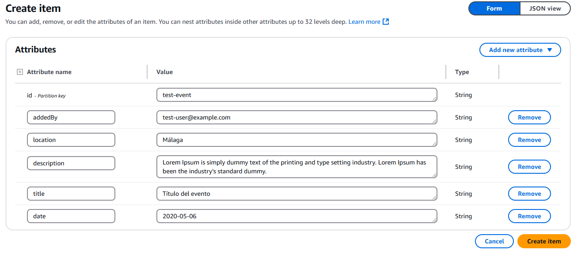

<p align="center">
    
</p>

# Laboratorio 1. DynamoDB

## Introducción

[DynamoBD](https://docs.aws.amazon.com/es_es/dynamodb/?id=docs_gateway) nos permitirá crear los servicios de persistencia necesarios para nuestra aplicación. En este caso, una tabla para almacenar los eventos creados en nuestra aplicación de gestión de eventos.

<p align="center">
    
</p>

## Creando la tabla

Será necesario seguir los siguientes pasos:

1. En la consola de AWS, en el menú Services buscaremos y seleccionaremos **DynamoDB**.

<p align="center">
    
</p>

> :warning: Hay que verificar que está seleccionada la región correcta. Cada uno de los servicios que se creen en los laboratorios (Cognito, API Gateway, Lambda y DynamoDB) deben pertenecer a la misma región. Para tener más información acerca de las regiones puedes acceder a este [enlace](https://docs.aws.amazon.com/es_es/AWSEC2/latest/UserGuide/using-regions-availability-zones.html). Para la elaboración de los laboratorios os sugerimos utilizar Irlanda.

<p align="center">
    
</p>

1. Seleccionamos *Create table*.
2. Introducimos:
   * Nombre: “events_XXXX”. Siendo XXXX un identificador para nuestra propia tabla. Hay que tener en cuenta que todos los asistentes compartimos un mismo servicio por lo que los identificadores deberán ser únicos para hacer uso de nuestros servicios propios. Os proponemos que utilicéis una abreviatura de vuestro nombre. Esta abreviatura la volveréis a usar al identificar otros recursos únicos que crearéis a lo largo de los laboratorios y os facilitará localizarlos.
   * **Primary Key**. Estableceremos los campos que la forman, en nuestro caso "id":
     * Partition key: id (string).

<p align="center">
    
</p>

3. En *Table settings*, desmarcamos la opción *default settings*, y establecemos la siguiente configuración:

   * En la sección Secondary indexes, hacemos click en add index:
     * En **partition key**, añadimos "addedBy" y type *String*.
     * En **index-name** lo dejamos como está.
     * En **Projected attributes**, indicamos *ALL*.
     * Finalmente, hacemos click en *add index*.

   <p align="center">
    
   </p>

   * En la sección *Read/Write capacity mode*, mantenemos aprovisionado.
   * En la sección *Auto Scaling*, desmarcamos las opciones *Read Capacity* y *Write Capacity*.
   * En la sección *Provisioned capacity*, establecemos todo a 1.
   * En la sección *Encryption At Rest*, mantenemos *Default*.

<p align="center">
    
</p>

4. Para facilitar la localización de nuestra tabla también vamos a añadir dos etiquetas:
   * **key**: "createdby"   **value**: [vuestro enterprise id]
   * **key**: "training"    **value**: "Openathon IV"

<p align="center">
    
</p>

5. Pulsamos *Create*, llevará en torno a 15 segundos la creación de la tabla. Una vez creada podremos acceder a todos sus detalles haciendo clic sobre el botón *Continue to table* o en la sección *tables* del servicio **DynamoDB**.

<p align="center">
    
</p>

6. En el panel de control de la tabla pulsamos la pestaña *items* y a continuación *Create item* para crear nuestro primer evento.
7. En el diálogo introduciremos los datos de nuestro primer evento:

<p align="center">
    
</p>

8. A continuación, introduciremos el resto de los datos. Pulsando el “+” adyacente a **addedBy**, seleccionaremos *Append* y *String*, indicando que queremos introducir en el ítem un dato de tipo cadena. Los ítems en las tablas de DynamoDB no tienen que cumplir una estructura obligatoria más allá de los que forman la primary key. De esta manera incorporaremos:

<p align="center">
    
</p>

* **Key** "location" – **Value** "Málaga"
* **Key** "description" – **Value** "Lorem Ipsum is simply dummy text of the printing and type setting industry. Lorem Ipsum has been the industry's standard dummy"
* **Key** "title" - **Value** "Título del evento"
* **Key** "date" – **Value** "2020-05-06"

<p align="center">
    
</p>

El ítem debe ser similar al siguiente json (pulsar en *Tree* y elegir *Text*):

```json
{
"id": "test-event",
"addedBy": "test-user@example.com",
"location": "Málaga",
"description": "Lorem Ipsum is simply dummy text of the printing and type setting industry. Lorem Ipsum has been the industry's standard dummy.",
"title": "Título del evento",
"date": "2020-05-06"
}
```

> :pushpin: **Recuerda el id del evento, lo necesitarás más adelante.**

9. Pulsamos *Save*. Hemos creado así el primer evento.

## Conclusión

En este laboratorio hemos creado una tabla para almacenar nuestros eventos. También Hemos insertado un evento de prueba. En el próximo laboratorio revisaremos las posibilidades del **IAM** para establecer roles y permisos.

[< Lab 00 ](../lab-00)  | [Lab 02 >](../lab-02)

<p align="center">
    
</p>
