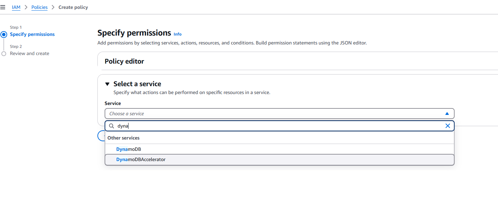

<p align="center">
    
</p>

# Laboratorio 2. IAM: Creación de roles (Sólo con cuenta privada)

:warning: **Sólo con cuenta privada. En el caso de las cuentas de formación, estará precreado** :warning:

## Introducción

El servicio de [Identity and Access Management](https://docs.aws.amazon.com/es_es/iam/?id=docs_gateway) (IAM) de AWS, permite controlar de forma segura el acceso a los recursos de AWS, tanto para usuarios, como para servicios AWS. En nuestro caso, utilizaremos IAM para crear las políticas y los roles necesarios para que nuestras funciones lambda accedan a los recursos que necesitan en su ejecución. Necesitaremos otorgarles permisos para:

- Realizar operaciones CRUD en DynamoDB.
- Dejar trazas en el servicio de logs de AWS (Cloudwatch).

## Políticas IAM

Las políticas IAM permiten establecer las condiciones de seguridad para el acceso a recursos o funciones dentro de AWS. Las políticas pueden seleccionarse dentro de un conjunto de predefinidas por Amazon o crearse de manera específica.

1. En la consola de AWS, en el menú Services buscaremos y seleccionaremos *IAM*.:exclamation::exclamation: IAM es un servicio global, por lo que no veras ninguna región seleccionada (aparecerá GLOBAL).

<p align="center">
    
</p>

2. Primero vamos a crear la *policy* para dar privilegios a nuestras funciones lambda para el acceso a la tabla creada en DynamoDB. En el menú de navegación del servicio, en la parte izquierda de la pantalla, pulsamos *Policies* y en la ventana resultante haremos clic sobre *Create Policy*.
3. En la ventana de creación de la *policy*, seleccionaremos *choose a service* y en el nombre del servicio buscaremos y seleccionaremos *DynamoDB*.

<p align="center">
    
</p>

4. Una vez seleccionado el servicio, es necesario introducir las acciones que queremos permitir en el mismo. Para hacerlo, introduciremos los nombres de las siguientes acciones para luego irlas seleccionando una a una:
   * DeleteItem
   * GetItem
   * PutItem
   * Query
   * Scan
   * UpdateItem
   * DescribeTable

<p align="center">
    
</p>

También podemos pulsar la opción *expand all* para seleccionar manualmente las acciones o comprobar que las hemos seleccionado correctamente.

5. A continuación, especificaremos el recurso sobre el que queremos aplicar estas acciones, pulsando  sobre *resources*:

<p align="center">
    
</p>

6. En el área desplegada podremos especificar el ARN de la tabla o index al que queremos aplicar las acciones. En nuestro caso, como sólo existe una tabla, podemos seleccionar la opción “Any”.

<p align="center">
    
</p>

7. Si pulsamos la pestaña *JSON* podremos visualizar en formato json la política que estamos creando:

```json
{
    "Version": "2012-10-17",
    "Statement": [
        {
            "Sid": "VisualEditor0",
            "Effect": "Allow",
            "Action": [
                "dynamodb:PutItem",
                "dynamodb:DescribeTable",
                "dynamodb:DeleteItem",
                "dynamodb:GetItem",
                "dynamodb:Scan",
                "dynamodb:Query",
                "dynamodb:UpdateItem"
            ],
            "Resource": "arn:aws:dynamodb:*:*:table/*"
        }
    ]
}
```

8. Pulsando *review policy* podremos acceder al resumen de la política creada, le ponemos un nombre *event_ddb_policy* y pulsamos *create policy*.
9. Ahora crearemos una segunda policy para que las funciones lambda puedan acceder al servicio de logs de AWS. Para crearla, utilizaremos esta vez directamente json. Volvemos a pulsar *Create Policy*.
10. En ventana pulsaremos la pestaña json y allí copiaremos:

```json
{
"Version": "2012-10-17",
  "Statement": [
    {
      "Effect": "Allow",
      "Action": [
       "logs:CreateLogGroup",
       "logs:CreateLogStream",
       "logs:PutLogEvents"
],
            "Resource": ["*"]
        }
    ]
}
```

11. De nuevo, pulsando *review policy* podremos acceder al resumen de la política creada, le ponemos un nombre como *event_logs_policy* y pulsamos *create policy*.

Podemos ahora comprobar que hemos generado nuestras políticas volviendo a la sección *Policies* del servicio IAM e introduciendo en el filtro de consulta *event_*, lo que debería resultar en:

<p align="center">
    
</p>

## Rol IAM

La manera de asignar a una función lamdba una policy es a través de un **Rol IAM**, por lo que debemos crear uno para nuestra aplicación.

1. Accedemos a la sección *Roles* del servicio **IAM** y pulsamos *Create Role*.
2. En la ventana resultante:
   a.	En el área **Select type of trusted entity** dejamos seleccionado “AWS service”.
   b.	En **Choose a use case** seleccionamos "Lambda”.

<p align="center">
    
</p>

3. Pulsamos *next:permissions*.
4. En la sección *Attach permissions policies*, introducimos como filtro “event_” y de los resultados seleccionamos:
   * event_ddb_policy
   * event_logs_policy
5. Pulsamos *Next: Tags*.
6. Pulsamos *Next: Review*.
7. Introducimos como nombre del Rol “EventsRole”.
8. Pulsamos *Create Role*.

Con ello nuestro rol estará creado y deberá ser accesible en la sección *Roles* del servicio **IAM**.

## Conclusión

Hemos creado dos políticas con las acciones necesarias para nuestras funciones lambda: el acceso de lectura y escritura a DynamoDB para acceder a la tabla events y el acceso al servicio de logs. Estas dos políticas las hemos agrupado en un rol que utilizaremos en los laboratorios posteriores para asignarselo a nuestras funciones lambda y que, de esta forma, AWS conozca que permisos tendrán dichas funciones en el momento de su ejecución.

En el siguiente laboratorio vamos a crear nuestra primera función lambda para recuperar los eventos que existan en nuestra tabla.

[< Lab 01 ](../lab-01)  | [Lab 03 >](../lab-03)

<p align="center">
    
</p>
