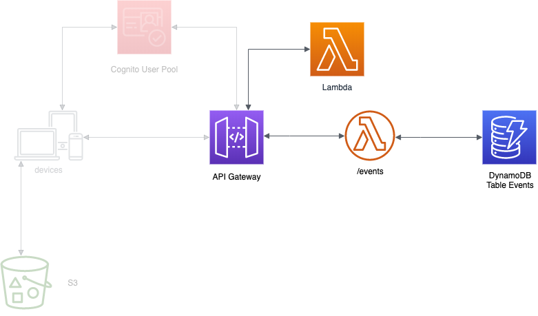
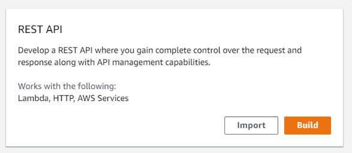
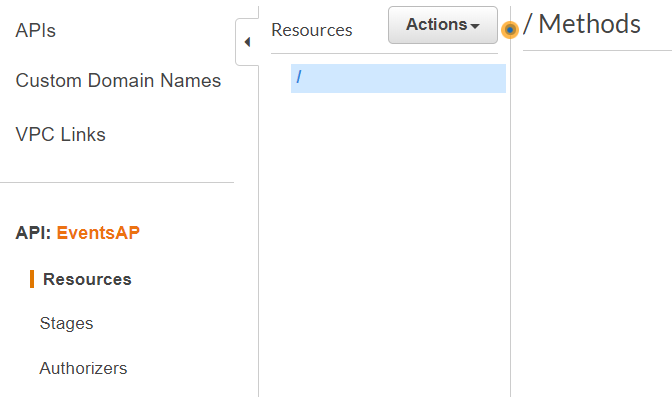
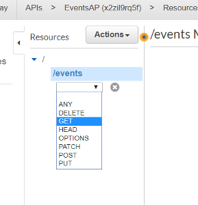
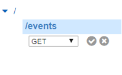
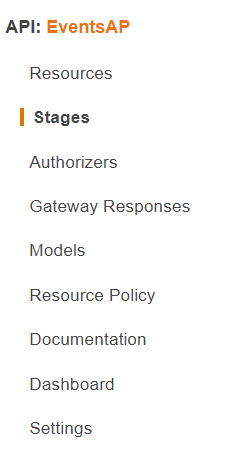
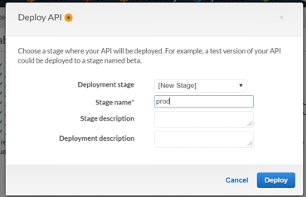
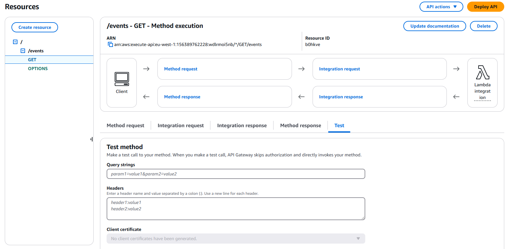

    

# Laboratorio 4.  Crear API Gateway sin seguridad

## Introducción

    

Una vez creada la función lambda deberemos crear un método para hacerla accesible a nuestra aplicación front. Para hacerlo utilizaremos el servicio [API Gateway](https://docs.aws.amazon.com/es_es/apigateway/?id=docs_gateway). Con él podemos crear API RESTful y API WebSocket que permiten aplicaciones de comunicación bidireccional en tiempo real. 
En este laboratorio crearemos un API Restful para publicar las funciones lambda que vayamos creando. 

Para securizar esta API utilizaremos [Cognito](https://docs.aws.amazon.com/es_es/cognito/?id=docs_gateway) para la autenticación, de forma que la proveeremos de la capa de seguridad necesaria. No obstante para facilitar la comprensión, la seguridad no la acometeremos en este laboratorio, centrándonos en cómo hacer accesible nuestra función y dejando para un laboratorio posterior la securización.

## Creando la API

1.	En la consola de AWS, en el menú Services buscaremos y seleccionaremos *API Gateway*.                                

> :warning: Hay que verificar que te encuentras en la región correcta. Cada uno de los servicios que se creen en los laboratorios (Cognito, API Gateway, Lambda y DynamoDB) deben pertenecer a la misma región. Para tener más información acerca de las regiones puedes acceder a este [enlace](https://docs.aws.amazon.com/es_es/AWSEC2/latest/UserGuide/using-regions-availability-zones.html). Para la elaboración de los laboratorios os sugerimos utilizar Irlanda.

2.	Pulsamos *Create API* (esta sección puede no aparecer la primera vez y mostrarse directamente la opción “Choose an API type”.
3.	En la ventana resultado, bajo la sección “Choose an API type”, seleccionamos “Rest API” (no "Rest API private") y pulsamos *Build*.

    

4.	En “Create your first API” pulsamos *OK*.
5.	Debajo de “Create new API” seleccionamos *NEW API*.
6.	Introducimos la siguiente información:

    * **API name**: EventsAP_XXXXXXX
    * **Description**: EventsAP
    * **Endpoint Type**: Regional
    * Pulsamos *Create API*.

Crearemos ahora los **Resources** a los que va a atender nuestra API.

12.	En el servicio API Gateway, dentro de la API:Events, pulsamos *Resources*
13.	Dentro de Resources, seleccionamos el root (“/”).

    

14.	Pulsamos *Actions* y en el desplegable seleccionamos *Create Resource* e introducimos:
    * **Name**: events
15.	Pulsamos *Create Resource*.
16.	Una vez creado el recurso debemos crear los métodos http para el recurso creado. Seleccionamos “/events” dentro de la sección **Resources** del API EventsAP.
17.	Pulsamos *Actions* y seleccionamos “Create Method”.
18.	Debajo del root de nuestro recurso se habrá creado un desplegable en el que seleccionaremos “GET”. Con ello vamos a habilitar la acción HTTP GET para nuestra API, en este caso, para recuperar los eventos existentes sin ningún filtro.

    

19.	Y pulsaremos el icono  para validarlo.

    

20.	Dentro de “/events - GET – Setup”:
    * Seleccionaremos “Lambda Function” (viene por defecto).
    * En “Lambda Function” introduciremos “E” lo que nos permitirá seleccionar la función lambda creada "Events-List-XXXX”.
21.	Pulsamos *save* para crear.
22.	En el dialogo resultante “Add Permission to Lambda Function”, confirmaremos la creación pulsando *OK*.
23.	Pulsamos en el resource “/events”.
24.	Desplegamos “Actions” y seleccionamos “enable CORS”. El Intercambio de Recursos de Origen Cruzado [(CORS)](https://developer.mozilla.org/en-US/docs/Web/HTTP/CORS) nos permitirá recibir solicitudes HTTP complejas.
25.	Pulsamos “Enable CORS and replace existing CORS headers”.

Para poder acceder a la API que hemos creado es imprescindible realizar su [deploy](https://docs.aws.amazon.com/es_es/apigateway/latest/developerguide/how-to-deploy-api.html). Este deploy se debe asociar con una versión o una etapa del ciclo de vida de la API (por ejemplo "v2" o "desarrollo") y permiten la ejecución de distintas versiones de la API. Los distintos deploys que fueramos creando, con las distintas versiones publicadas, las podríamos encontrar en la opción **Stages** 

    

26.	Pulsamos de nuevo *Actions* y seleccionamos “Deploy API”, haciendo los siguientes cambios:

    * **Deployment stage**: [New Stage]
    * **Stage name**: prod

    

27.	Pulsamos *deploy*.
28.	Copiamos el valor de “Invoke URL”, lo necesitaremos después.
29.	Pulsamos la pestaña “Logs/Tracing”.
30.	En la configuración de Cloudwatch, marcamos “Enable CloudWatch Logs”.
31.	Seleccionamos "INFO" como log level.
32.	Marcamos “Log full requests/responses data”
33.	Pulsamos *Save changes*.

## Probar la API

Para probar si todo funciona correctamente tendremos que volver a pulsar en la opción "Resources" de nuestra API EventsAP y seleccionar el método creado GET.

    

Para lanzar la prueba pulsaremos en el icono del rayo situado debajo de "TEST". En la ventana de parámetros podríamos establecer los datos de entrada de prueba, pero en el caso de nuestra función ListEvents no es necesario, ya que no necesita ninguno. Pulsamos por tanto el botón *Test* de la parte inferior de la ventana y si todo va bien podremos comprobar la salida de la función, en este caso el evento de prueba que añadimos en la base de datos, así como los datos incluidos en el header de la respuesta y los logs de la ejecución de la API.

También podemos probar directamente nuestra API desde un navegador si introducimos la "Invoke URL" que obtuvimos al realizar el deploy de nuestra API. Si no la guardamos en su momento podemos recuperarla dentro de la opción "stage" de la API, desplegar el stage "prod" y seleccionar la opción "GET", lo que nos llevará a la página donde podremos consultar la URL a invocar (algo parecido a xxxxxx.execute-api.eu-west-1.amazonaws.com/prod/events").

## Conclusiones

Hemos realizado ya la publicación a través de la API de nuestra función lambda, que ya podría ser accesible desde una aplicación cliente. En los siguientes laboratorios vamos a dotar la Solución de la seguridad necesaria e integrarla con nuestra aplicación angular.

[< Lab 03 ](../lab-03)  | [Lab 05 >](../lab-05)

    

