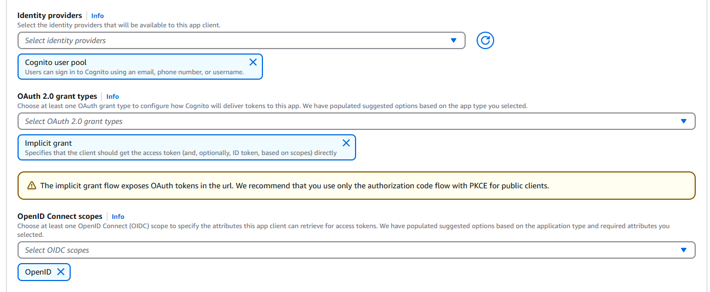

    

# Laboratorio 5. Cognito

## Introducción

    

[AWS Cognito](https://docs.aws.amazon.com/es_es/cognito/?id=docs_gateway) proporciona autenticación, autorización y administración de usuarios para sus aplicaciones y, en nuestro caso, a los servicios de AWS que estamos utilizando, les proporciona la capa de seguridad necesaria para el control del acceso. Podemos usar cognito con diversos proveedores de autenticación como Facebook, Amazon, Google o Apple.

Los dos componentes principales de Amazon Cognito son los grupos de usuarios y los grupos de identidades.

* **Los grupos de usuarios** son directorios de usuarios que proporcionan a los usuarios de las aplicaciones opciones para inscribirse e iniciar sesión.
* **Los grupos de identidades** permiten conceder a los usuarios acceso a otros servicios de AWS. Se pueden utilizar los grupos de identidades y los grupos de usuarios juntos o por separado.

Cognito provee de tres servicios:

- **Amazon Cognito Federated Identities**. Permiten crear identidades únicas para sus usuarios y federarlas con proveedores de identidad. Con un grupo de identidades, podemos obtener credenciales de AWS temporales con privilegios limitados para obtener acceso a otros servicios de AWS.
- **Amazon Cognito User Pools**. Directorio de usuarios en Amazon Cognito, permite a los usuarios iniciar sesión en su aplicación web o móvil a través de Amazon Cognito. Los usuarios también pueden iniciar sesión a través de proveedores de identidad sociales como Google, Facebook, Amazon o Apple y a través de proveedores de identidad SAML.
- **Amazon Cognito Sync**. Permite sincronizar los datos de los usuarios, como las preferencias de la aplicación. También amplía estas funcionalidades, ya que permite que diferentes usuarios se sincronicen y colaboren en tiempo real sobre los datos compartidos.

Para nuestra aplicación utilizaremos un **User Pool**:

- Crearemos un “Cognito User Pool” para el control de acceso de los usuarios finales de nuestra aplicación a un endpoint REST publicado a través del servicio API Gateway, dotando de seguridad a nuestra aplicación.
- Añadiremos un usuario en el pool para comprobar el correcto funcionamiento de la aplicación.

## Creación del User Pool

Para crearlo seguiremos los siguientes pasos:

1. En la consola de AWS, en el menú **Services** buscaremos y seleccionaremos “Cognito”.

  

> :warning: Hay que verificar que está seleccionada la región correcta. Cada uno de los servicios que se creen en los laboratorios (Cognito, API Gateway, Lambda y DynamoDB) deben pertenecer a la misma región. Para tener más información acerca de las regiones puedes acceder a este [enlace](https://docs.aws.amazon.com/es_es/AWSEC2/latest/UserGuide/using-regions-availability-zones.html). Para la elaboración de los laboratorios os sugerimos utilizar Irlanda.

2. Crearemos un nuevo pool de usuarios pulsando en el menú lateral izquierdo *User Pools* y *Create a user pool*.

  

  

3. AWS estable por defecto un nombre para el pool que renombraremos posteriormente por: “EventAppPool_XXXX” (siendo XXXX el identificador único que estés usando) y selecciona en Application Type *Single Page Application (SPA)*.
4. En la seccion **Name your application** definimos el nombre de la aplicación “EventAppAngular_XXXX” (siendo XXXX el identificador único que estes usando).
5. En la sección **Configure Options / Options for sign-in identifiers**, elegimos "Email address or phone number".
   El resto de las opciones las dejaremos por defecto y pulsaremos en *Create*.

  

Se ha creado un [User Pool App Client](https://docs.aws.amazon.com/es_es/cognito/latest/developerguide/user-pool-settings-client-apps.html) dentro de nuestro **User pool**. Esta App Client es una entidad dentro de un user pool que tiene permiso para llamar a API sin autenticar (API que no tengan un usuario autenticado), como las APIs de registro, inicio de sesión y gestión de contraseñas olvidadas, a las que lógicamente el usuario accede sin haber presentado aún creedenciales.

6. Renombraremos el nombre del pool por: “EventAppPool_XXXX” (siendo XXXX el identificador único que estés usando) pulsando **Rename**.

7. En el menú de la izquierda pulsaremos en **App clients** y seleccionamos el app client Name que hemos creado y en la pestaña **Login Pages** pulsamos en **Edit**
    * En **Identity providers** selecciona **Cognito user pool**
    * En **OAuth 2.0 grant types** deja solo **Implicit grant**
    * En **OpenID Connect scopes** deja solo **OpenID**
   Y pulsamos **Save Changes**.

  

8. En el menú de la izquierda pulsaremos en **Authentication methods** y pulsamos **Edit** en **Password policy** 
9. Seleccionamos **Custom**, estableceremos las limitaciones para las passwords.
   Puedes cambiar:
   * La longitud mínima de la password: la dejaremos en 6.
   * Obligatoriedad de caracteres especiales, mayúsculas...: por comodidad, quitamos todas.
   El resto de las opciones las dejaremos por defecto y pulsaremos *Save changes*.

10. En el menú de la izquierda, en ** Manage Login**, revisamos si tiene algún estilo de ventana asociado a nuestra app Client. Si no fuera así pulsaremos en  **Create Style** y seleccionando la app Client pulsamos en **Create**. Si todo ha ido bien, debemos navegar a una ventana donde veremos las ventana que se mostrará para hacer login.

11. Debemos copiar y salvar dos datos muy importantes: el **Pool id** (identificación única para el pool creado) y el **Pool ARN** (el Amazon Resource Name para poder acceder a él), los utilizaremos más tarde en nuestra aplicación:
    * **Pool Id**: eu-central-1_XXXXXXXX
    * **Pool ARN**: arn:aws:cognito-idp:eu-central-1:128434942847:userpool/eu-central-1_XXXXXXX
12. En el panel de navegación a la izquierda, dentro de **General Settings**, pulsaremos “App Clients” y salvaremos también el **App client id** de la app client “EventAppAngular”. Este id permitirá a nuestros usuarios acceder a los servicios de login sin que se solicite autenticación previa.

## Etiquetando el User Pool

Ahora, para facilitar la localización de nuestro User Pool, vamos a etiquetarlo.

En la sección de detalle del User Pool creado, en el menú de la izquierda, dentro de *general settings* está la opción *Tags*, donde se pueden añadir dos etiquetas que permitan localizar más fácilmente el pool:

* **key**: "createdby"   **value**: [vuestro enterprise id]
* **key**: "training"    **value**: "Openathon IV"

## Habilitar OAuth2.0

Para poder autenticarnos contra cognito desde postman con una interfaz visual, vamos a crear un dominio para cognito, y habilitar otras propiedades:

1. En el menú de la izquierda, pulsamos en **Domain name**.
2. Introducimos un prefijo de dominio, por ejemplo, XXXX-events-app, y hacemos click en *Save changes*. La url entera la tenemos que apuntar porque la necesitaremos más adelante.
3. En el menú de la izquierda, pulsamos en *App client settings* en la sección "App Integration".
4. Habilitamos Cognito User Pool.
5. En Callback URL ponemos *myapp://example* (en nuestra caso es irrelevante).
6. En Allowed OAuth Flows, hacemos click en "Implicit grant".
7. En Allowed OAuth Scopes, hacemos click en "openid".
8. Finalmente, hacemos click en *save changes*.

## Creación de un usuario para el User Pool

1. Dentro de la ventana de administración del user pool que hemos creado (AWS Service **Cognito**, opción “Manage User Pool”), seleccionando el user pool “EventAppPool”. En el panel de navegación a la izquierda, dentro de “General Settings”, pulsaremos *User and Groups* y *create user*.
2. En la ventana emergente introduciremos el nombre y la contraseña que prefiramos (aunque tendrá que cumplir las condiciones que especificamos en la creación del userpool), desmarcando el envío de invitación y las verificaciones del teléfono y el email.

  

## Conclusión

Con los pasos realizados en este laboratorio tenemos ya creado un servicio de identidad que permitirá a nuestra aplicación angular disponer de un servicio de login para el acceso a las funciones lambda que publiquemos a través de endpoints REST publicados a través del servicio API Gateway.

En el caso que estés usando el usuario de formación para realizar las actividades, considera que el login está utilizando Cognito para autenticarte y que éste tiene configurado a Accenture como proveedor de identidad para permitir el uso de los EID.

[< Lab 04 ](../lab-04)  | [Lab 06 >](../lab-06)

    

