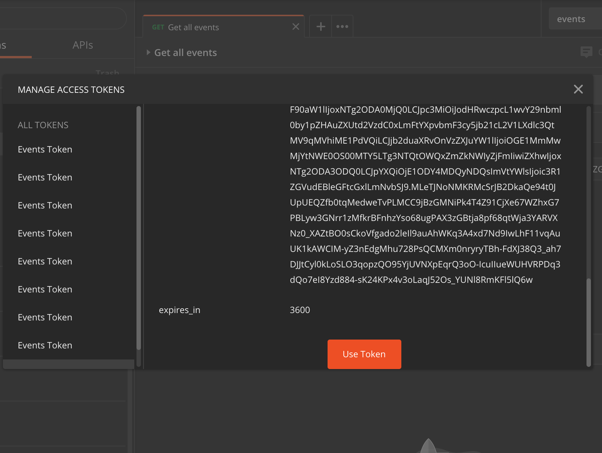

    

# Laboratorio 6. Securizar Get /events

## Introducción

    

En los laboratorios anteriores creamos el endpoint para acceder a la función lambda que obtiene y devuelve todos los eventos creados en la base de datos utilizando API Gateway.

En este laboratorio, vamos a añadirle dos capas de seguridad para controlar quién puede acceder:

* **Token de usuario**: vamos a añadir la cabecera Authorization, de forma que sólo los usuarios autenticados puedan ver los eventos.
* **API Key**: vamos a añadir la cabecera x-api-key, para limitar el uso de nuestra API añadiendo un plan de uso. El objeto de este plan de uso es garantizar que, en el caso de que alguien acceda a la URL de nuestra API, no pueda saturarla con miles de peticiones.

Para implementar el uso del token de usuario, debemos crear un Authorizer con el pool de usuarios que hemos creado en los laboratorios anteriores.

## API Key y Usage Plan

Para crear el API Key seguiremos los siguientes pasos:

1. Navegamos al servicio **API Gateway** y seleccionamos nuestra API. Hacemos click en la opción *API Keys* del menú de la izquierda.
2. Hacemos click en *Actions*, y luego en *Create API Key*.

  

3. En el formulario, ponemos un nombre (p. ej. "identification_XXXX", identificando de manera única nuestra API Key) y guardamos.
4. Nos aparecerá la información del API Key. Si hacemos click en *Show*, podemos ver la clave.
   :pushpin: **Guárdala, porque la necesitarás más adelante.**

Ahora vamos a asociarle un plan de uso al API key:

1. Volvemos a la sección de configuración de la API en el servicio API Gateway y seleccionamos la opción **Usages Plan** del menú de la izquierda.
2. Hacemos click en *Create*.
3. En el formulario, completamos los campos:

   * **Name:** indicamos un nombre significativo (p. ej. "EventsUsagePlan").
   * **Enable throttling:** lo dejamos habilitado.
   * **Rate:** 1.
   * **Burst:** 1.
   * **Enable quota:** lo dejamos habilitado.
   * **Requests per:** 200 per month.

   > Como veis, hemos establecido los límites de peticiones por segundo que pueden recibir y el máximo total que nuestra API admitirá al mes.
   >
4. Hacemos click en *Next*.
   Ahora, en la configuración de la API, vamos a seleccionar el *deploy stage* al que queremos aplicar el **Usage Plan**. En nuestro caso sólo tenemos un plan previamente creado ("prod").
5. Hacemos click en *Add API Stage*.
6. En API, elegimos el nombre de nuestra API.
7. En Stage, elegimos el stage, ("prod" si hemos seguido las instrucciones anteriores). Hacemos click en el icono de Ok del registro añadido.
8. Hacemos click en Next.
9. Hacemos click en Add API Key to Usage Plan.
10. En name indicamos el nombre de nuestra API key ("identification_XXXX" en nuestro ejemplo) y hacemos click en el icono de *Ok*.
11. Hacemos click en *done*.

De esta forma ya tenemos un plan de uso asociado al stage de nuestra API.

## Creación de un Authorizer

Para poder hacer uso de la autorización a través de Cognito, es necesario crear un Authorizer con el pool de usuarios que hemos creado anteriormente.

1. Entramos en el servicio **API Gateway** y en el menú de la izquierda, pulsamos sobre **Authorizers**.
2. Pulsamos *Create new authorizer*.

  

2. Rellenamos el nombre del authorizer (p. ej:event_authorizer).
3. En la opción tipo, seleccionamos "Cognito".
4. En la sección Cognito User Pool introducimos el nombre del pool que hemos creado en Cognito.
5. En Token source (Origen del token), escribimos "Authorization".
6. Pulsamos Create.

## GET /events endpoint

Vamos a añadirle la capa de seguridad al endpoint GET /events de nuestra API:

1. Dentro del servicio API Gateway, en la sección de **resources** de la configuración de la API hacemos click en */events* > *GET*
2. Hacemos click en *Method Request*.
3. En la sección de settings:

   * En **Authorization** vamos a seleccionar el authorizer creado.

   > :warning: **Si no aparece el authorizer que acabas de crear, prueba a recargar la página, o a esperar unos minutos.**
   >

   * En **OAuth Scopes**, dejamos "openid"
     :warning:(Esta configuración la utilizamos sólo por razones de prueba, para poder usarlo desde Postman. A la hora de integrarlo en una app, debe dejarse en None).:warning:
   * En **Request Validator**, mantenemos "None".
   * En **API Key Required**, seleccionamos "True".

De esta forma, para usar el endpoint *GET /events*, será necesario conocer tanto el API key como un token de usuario.

### Probar endpoint

#### Desplegar la API

Lo primero que tenemos que hacer es desplegar la API:

1. Click en *Actions*.
2. Click en *Enable CORS*.
3. Click en *Enable CORS and replace existing CORS headers*.
4. Volvemos atrás y hacemos click en *Actions*.
5. Click en *Deploy API*.
6. Elegimos el stage y damos a *Deploy*.

#### Preparar Postman

Para probar la API, vamos a utilizar **Postman**. El fichero con la descripción de la API está en el siguiente enlace: [postman_collection.json](./resources/events-app.postman_collection.json).
El primer paso es importar el fichero en postman:

1. Abrimos Postman.
2. Hacemos click en *import*.

    

3. Hacemos click en *choose files* y elegimos el json que hemos descargado.

    

De esta forma se creará una nueva colección que podemos ver en el menú de la izquierda, con los 6 endpoints que acabamos de importar.

    

Además, necesitamos importar el [entorno](./resources/events.postman_environment.json) con las variables que necesitaremos para probar nuestra API:

1. Hacemos click en *import*.
2. Hacemos click en choose files y elegimos el json que hemos descargado.

    

Esto nos creará un nuevo entorno en postman llamado "events" con las siguientes variables:

1. **apiKey**: es la API Key creada anteriormente.
2. **apiUrl**: es la url de nuestra api desplegada. Se puede obtener accediendo a la API y pulsando en stages y seleccionando el deploy que hayamos realizado ("prod" si hemos seguido las instrucciones).
3. **eventid**: es el identificador de algún evento creado en la base de datos. Para obtener uno puedes dirigirte a **DynamoDB**, seleccionar la tabla que hayas creado y en la pestaña "Items" consultar un registro, el campo **id** será el identificador único.
4. **userPoolWebClientId**: es el client id de nuestra app en Cognito. Para recuperarlo, tenemos que acceder al **User Pool** que hemos creado en Cognito, seleccionar *App Clients* dentro de *General Settings* y allí encontraremos el valor en el campo *App client id*.
5. **cognitoDomain**: es el dominio creado en Cognito de nuestra app en el [laboratorio 5](../lab-05). Podemos recuperarlo del user pool de **Cognito**, accediendo a *Domain Name* dentro de *App Integration* y allí recuperar el campo "Domain prefix".

Simplemente hay que editarlas:

1. Hacemos click en el icono con forma de ojo.
2. Al lado de cada variable, hacemos click en el lápiz.

    

3. Indicamos el valor de cada variable.

Para probar cada endpoint:

1. Hacemos click en él, desde el menú de la izquierda.

    

2. En la pestaña **Authorization**, hacemos click en *Get New Access Token*.

    

3. En la ventana abierta:
   * **Token name**: Events Token
   * **Grant type**: Implicit
   * **Callback URL**: myapp://example
   * **AuthURL**: {{cognitoDomain}}/login
   * **Client ID**: {{userPoolWebClientId}}
   * **Scope**: openid
   * **State**: lo dejamos vacio
   * **Client Authentication**: Send client credentials in body
4. Hacemos click en *Request token*.
5. En la ventana abierta, usamos el usuario que creamos en el [laboratorio 5](../lab-05).

    

6. Al iniciar sesión (es posible que la primera vez os pida establecer una nueva contraseña si así lo establecísteis al crear el *User Pool*), veremos que hemos obtenido el token de seguridad necesario para que Postman pueda realizar peticiones a nuestra API.

    

7. En la parte inferior de la ventana hacemos click en Use Token.

    

6. Finalmente, hacemos click en *send* y veremos la respuesta.

> :warning: **La API puede tardar un rato en desplegarse en las cuentas de formación. Si en Postman, las pruebas indican que no hubo respuesta, recomendamos esperar un poco y volver a probar.**

Por último, volvemos al servicio API Gateway y dentro de method request, establecemos el campo **Oauth Scopes** a "None" y volvemos a realizar el deploy.

## Resumen

En este laboratorio hemos securizado nuestro primer end-point haciendo uso de **Cognito** y de un plan de uso asociado a un **api-key** para controlar el consumo. Además hemos aprendido como utilizar Postman para realizar una prueba completa.

En el siguiente paso realizaremos el resto de funciones necesarias para completar la API que requiere nuestra App.

[< Lab 05 ](../lab-05)  | [Lab 07 >](../lab-07)

    

