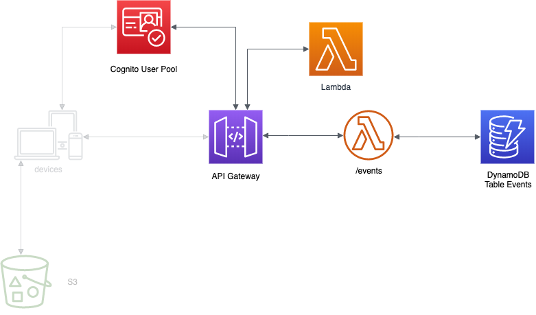

<p align="center">
    
</p>

# Laboratorio 7. Completar la API

## Introducción

<p align="center">
    
</p>

En el laboratorio anterior hemos securizado el endpoint que nos devuelve todos los eventos. Ahora vamos a crear y securizar el resto de endpoint:

1. [**Crear endpoint para dar de alta eventos (POST /events)**](#crear-endpoint-para-dar-de-alta-eventos-post-events)
2. [**Crear endpoint para obtener los eventos de un usuario (GET /events/me)**](#crear-endpoint-para-obtener-los-eventos-de-un-usuarioget-eventsme)
3. [**Crear endpoint para recuperar el detalle de un evento (GET /events/{eventid})**](#crear-endpoint-para-recuperar-el-detalle-de-un-eventoget-eventseventid)
4. [**Crear endpoint para actualizar un evento (PUT /events/{eventid})**](#put-eventseventsid-endpoint)
5. [**Crear endpoint para eliminar un evento (DELETE /events/{eventid})**](#delete-eventseventsid-endpoint)


## Crear endpoint para dar de alta eventos (POST /events)

A través de este endpoint se podrán crear nuevos eventos.

[Crear función python >](../lambda-functions-python/CreateEvent)

[Crear función java >](../lambda-functions-java/CreateEvent)

[Probar función lambda >](Testing_Create_Event.md)


### Crear endpoint

Para crear el endpoint, accedemos al API que hemos creado ("API_EVENTS_XXXX"):

1. Pinchamos en */events*
2. Hacemos click en *Actions* y luego en *Create Method*. Elegimos *POST*.
3. En la ventana abierta:
 * En **Integration Type**, lo dejamos a "Lambda Function".
 * En **Lambda Region**, lo dejamos a la región que estemos usando durante todos los laboratios.
 * En **Lambda Function**, elegimos la función lambda para crear nuevos eventos.
 * Hacemos click en *Save*
4. Hacemos click en *Method request*.
5. En la sección de *settings*:
 * En **Authorization**, elegimos el authorizer creado para la API.
 * En **OAuth Scopes**, lo dejamos a "openid". 
 :warning:(Esto solo es por propósitos de testing para usarlo desde Postman. Cuando lo integremos con la app, lo dejaremos a None).:warning:
 * En **Request Validator**, lo dejamos a "None".
 * En **API Key Required**, lo dejamos a "True".
 
### Probar endpoint

Lo primero que tenemos que hacer es desplegar la API:

1. Click en *Actions*.
2. Click en *Enable CORS*.
3. Click en *Enable CORS* and replace existing CORS headers*.
4. Volvemos atrás y hacemos click en *Actions*.
5. Click en *Deploy API*.
6. Elegimos el *stage* "prod" y damos a *Deploy*.

Después, abrimos postman:

1. Nos aseguramos que estamos usando el **entorno events**.
2. Hacemos click en *Post events*, en el menu de la izquierda en la *colección events*.
3. Vamos a la pestaña *Authorization* y nos aseguramos que el campo *Access Token* está relleno. En caso de que no, damos a *Get access Token*, y seguimos los pasos [anteriores](lab-06#preparar-postman).
4. Vamos a la pestaña de *Body*, he introducimos un json con el evento a crear, similar al siguiente:

```json
{
    "title": "Hola",
    "location": "Madrid",
    "date": "1997-01-01",
    "description": "dfnsbfiusduigsf",
    "addedBy": "student@example.com",
    "id": ""
}
```

5. Hacemos click en *Send*, y deberiamos de recibir un **200 OK**. En caso de que recibamos un 401, tenemos que generar un nuevo token. Para ello, vamos a la pestaña *Authorization*, y damos a *Get Access Token*, y seguimos los pasos [anteriores](lab-06#preparar-postman).


Finalmente, para que nuestro endpoint se pueda utilizar desde nuestra aplicación **Angular**, volvemos al **Api Gateway**, y dentro de method request, **debemos dejar el campo OAuth Request a None**, y después tenemos que desplegar la API. Esto implica que este endpoint no vamos a poder probarlo desde **Postman**.


## Crear endpoint para obtener los eventos de un usuario(GET /events/me)

Este endpoint nos permitirá obtener los eventos del usuario autenticado.

### Crear función lambda

[Crear función python >](../lambda-functions-python/GetEventsMe)

[Crear función java >](../lambda-functions-java/GetEventsMe)

[Probar función lambda >](Testing_Get_Events_Me.md)

### Crear endpoint

Para crear el endpoint, accedemos al API que hemos creado ("API_EVENTS_XXXX"):

1. Pinchamos en */events*
2. Hacemos click en *Actions* y luego en *Create Resource*:
   * **Resource Name**: "Mis eventos"
   * **Resource Path**: "me"
3. Hacemos click en *Create Resource*.
4. Hacemos click en */me*. Luego en *Actions* y en *Create Method*. Elegimos *GET*.
5. En la ventana abierta:
 * En **Integration Type**, lo dejamos a "Lambda Function".
 * En **Lambda Region**, lo dejamos a la región que estemos usando durante todos los laboratios.
 * En **Lambda Function**, elegimos la función lambda para obtener los eventos de un usuario.
 * Hacemos click en *Save*
6. Hacemos click en *Method request*.
7. En la sección de settings:
 * En **Authorization**, elegimos el authorizer creado.
 * En **OAuth Scopes**, lo dejamos a None.                                                                                
 * En **Request Validator**, lo dejamos a "None".
 * En **API Key Required**, lo dejamos a "True".
8. Volvemos atrás, y hacemos click en Integration Request:
 * En **Mappings Template**:
   * Hacemos click en *When there are no templates defined (recommended)*
   * Hacemos click en *Add Mapping Template* y escribimos "application/json"
   * En el editor que se nos ha abierto ponemos:
   ```json
   {
   "addedBy" : "$context.authorizer.claims.email"
   }
   ```
   * Hacemos click en *Save*

### Probar endpoint

Como en el caso de crear eventos, tendriamos que desplegar la API. Después, desde **Postman**, dentro de la *colección events*, debemos seleccionar la petición que se corresponde con nuestro endpoint. En este caso, además, debemos hacer un paso adicional:

1. Vamos a la pestaña *Authorization*
2. Hacemos click en *Get New Access Token*.
3. Validamos que los datos son correctos.
4. Hacemos el login.
5. En la respuesta recibimos, entre otros:
    * **accessToken**: nos da acceso a la API, pero no tememos información del usuario (en este caso el **email**).
    * **idToken**: nos da accesso a la API y ademas tenemos información del usuario, en este caso, el **email**.
6. Copiamos el *idToken*.
> Postman copia el accessToken, pero este no nos vale, porque en el mapping template del endpoint, necesitamos obtener el email del usuario, que está en el idToken.
7. Cerramos la ventana y lo pegamos en el campo *AccessToken*.
8. Hacemos click en *Send*.

## Crear endpoint para recuperar el detalle de un evento(GET /events/{eventid})

Este endpoint nos permitirá obtener el detalle de un evento por el identificador.

### Crear función lambda

[Crear función python >](../lambda-functions-python/GetEventId)

[Crear función java >](../lambda-functions-java/GetEventId)

[Probar función lambda >](Testing_Get_Events_Id.md)


### Crear endpoint

Para crear el endpoint, accedemos al API que hemos creado ("API_EVENTS_XXXX"):

1. Pinchamos en */events*
2. Hacemos click en *Actions* y luego en *Create Resource*:
   * **Resource Name**: "Eventos por id"
   * **Resource Path**: "{eventid}"
3. Hacemos click en *Create Resource*.
4. Hacemos click en */{eventid}*. Luego En *Actions* y en *Create Method*. Elegimos *GET*.
5. En la ventana abierta:
 * En **Integration Type**, lo dejamos a "Lambda Function".
 * En **Lambda Region**, lo dejamos a la región que estemos usando durante todos los laboratios.
 * En **Lambda Function**, elegimos la función lambda para obtener eventos por su id.
 * Hacemos click en *Save*
6. Hacemos click en *Method request*.
7. En la sección de settings:
 * En **Authorization**, elegimos el authorizer creado.
 * En **OAuth Scopes**, lo dejamos a "openid".                                                                                 :warning:(Esto solo es por propósitos de testing para usarlo desde Postman. Cuando lo integremos con la app, lo dejaremos a None).:warning:
 * En **Request Validator**, lo dejamos a "None".
 * En **API Key Required**, lo dejamos a "True".
8. Volvemos atrás, y hacemos click en *Integration Request*:
 * En **Mappings Template**:
   * Hacemos click en *When there are no templates defined (recommended)*
   * Hacemos click en *Add Mapping Template* y escribimos "application/json"
   * En el editor que se nos ha abierto ponemos:
   ```json
   {
   "id": "$input.params('eventid')"
   }
   ```
   * Hacemos click en *Save*

### Probar endpoint

Como en el caso de crear eventos, tendriamos que desplegar la API. Después, desde **Postman**, dentro de la *colección events*, la que se corresponde con nuestro endpoint. Para este caso, podemos modificar en las variables de entorno de Postman *eventid*, poniéndole el id de un evento existente.

Finalmente, para que nuestro endpoint se pueda utilizar desde nuestra aplicación **Angular**, volvemos al **Api Gateway**, y dentro de method request, **debemos dejar el campo OAuth Request a None**, y después tenemos que desplegar la API. Esto implica que este endpoint no vamos a poder probarlo desde **Postman**.


## Crear endpoint para editar eventos (PUT /events/{eventsId})

Este endpoint nos permitirá editar un evento.

### Crear función lambda

[Crear función python >](../lambda-functions-python/EditEventId)

[Crear función java >](../lambda-functions-java/EditEventId)

[Probar función lambda >](Testing_Edit_Event.md)

### Crear endpoint

Para crear el endpoint, accedemos al API que hemos creado ("API_EVENTS_XXXX"):

1. Hacemos click en */{eventid}*. Luego en *Actions* y en *Create Method*. Elegimos *PUT*.
2. En la ventana abierta:
 * En **Integration Type**, lo dejamos a "Lambda Function".
 * En **Lambda Region**, lo dejamos a la región que estemos usando durante todos los laboratios.
 * En **Lambda Function**, elegimos la función lambda para editar eventos.
 * Hacemos click en *Save*
3. Hacemos click en *Method request*.
4. En la sección de settings:
 * En **Authorization**, elegimos el authorizer creado.
 * En **OAuth Scopes**, lo dejamos a "openid"                                                                                :warning:(Esto solo es por propósitos de testing para usarlo desde Postman. Cuando lo integremos con la app, lo dejaremos a None).:warning:
 * En **Request Validator**, lo dejamos a "None".
 * En **API Key Required**, lo dejamos a "True".

### Probar endpoint

Como en el caso de crear eventos, tendriamos que desplegar la API. Después, desde **Postman**, dentro de la *colección events*, la que se corresponde con nuestro endpoint.

Finalmente, para que nuestro endpoint se pueda utilizar desde nuestra aplicación **Angular**, volvemos al **Api Gateway**, y dentro de method request, **debemos dejar el campo OAuth Request a None**, y después tenemos que desplegar la API. Esto implica que este endpoint no vamos a poder probarlo desde **Postman**.

## Crear endpoint para eliminar un evento(DELETE /events/{eventid})

Este endpoint nos permitirá borrar un evento.

### Crear función lambda

[Crear función python >](../lambda-functions-python/DeleteEventId)

[Crear función java >](../lambda-functions-java/DeleteEventId)

[Probar función lambda >](Testing_Delete_Event.md)


### Crear endpoint

Para crear el endpoint, accedemos al API que hemos creado ("API_EVENTS_XXXX"):

1. Hacemos click en *{eventid}*. Luego en *Actions* y en *Create Method*. Elegimos *DELETE*.
2. En la ventana abierta:
 * En **Integration Type**, lo dejamos a Lambda Function.
 * En **Lambda Region**, lo dejamos a la región que estemos usando durante todos los laboratios.
 * En **Lambda Function**, elegimos la función lambda para eliminar eventos.
 * Hacemos click en *Save*
3. Hacemos click en *Method request*.
4. En la sección de settings:
 * En **Authorization**, elegimos el authorizer creado.
 * En **OAuth Scopes**, lo dejamos a "openid".                                                                                  :warning:(Esto solo es por propósitos de testing para usarlo desde Postman. Cuando lo integremos con la app, lo dejaremos a None).:warning:
 * En **Request Validator**, lo dejamos a "None".
 * En **API Key Required**, lo dejamos a "True".
5. Volvemos atrás, y hacemos click en *Integration Request*:
 * En **Mappings Template**:
   * Hacemos click en *When there are no templates defined (recommended)*
   * Hacemos click en *Add Mapping Template* y escribimos "application/json"
   * En el editor que se nos ha abierto ponemos:
   ```json
   {
   "id": "$input.params('eventid')"
   }
   ```
   * Hacemos click en *Save*

### Probar endpoint

Como en el caso de crear eventos, tendriamos que desplegar la API. Después, desde **Postman**, dentro de la *colección events*, la que se corresponde con nuestro endpoint.

Finalmente, para que nuestro endpoint se pueda utilizar desde nuestra aplicación **Angular**, volvemos al **Api Gateway**, y dentro de method request, **debemos dejar el campo OAuth Request a None**, y después tenemos que desplegar la API. Esto implica que este endpoint no vamos a poder probarlo desde **Postman**.

## Resumen

En este laboratorio, hemos completado el resto de nuestra API. Además, la hemos securizado haciendo uso de **Cognito** y de un plan de uso asociado a un **api-key** para controlar el consumo. El siguiente paso, es integrarla con nuestra aplicación frontend.

[< Lab 06 ](../lab-06)  | [Lab 08 >](../lab-08)

<p align="center">
    
</p>

