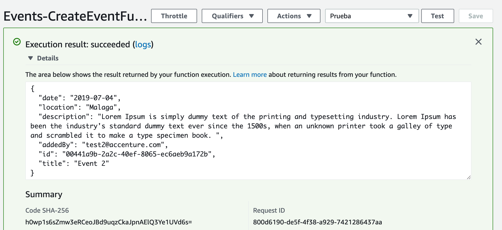

# Probar la función para crear eventos

Creamos un test de prueba cuya entrada es la siguiente:

```json
{
  "date": "2019-07-04",
  "location": "Malaga",
  "description": "Lorem Ipsum is simply dummy text.",
  "addedBy": "test2@accenture.com",
  "id": "",
  "title": "Event 2"
}
```

donde,

* **id**: lo dejamos vacio porque lo genera la función lambda.
* **addedBy**: es el correo del autor del evento.
* **date**: fecha de creación
* **location**: localización del evento
* **description**: descripción del evento 
* **title**:: titulo del evento.

Si la ejecución tiene éxito, nos devolverá el evento editado:

<p align="center">
    
</p>

[< Volver al Laboratorio 07 ](../lab-07#crear-endpoint) 

