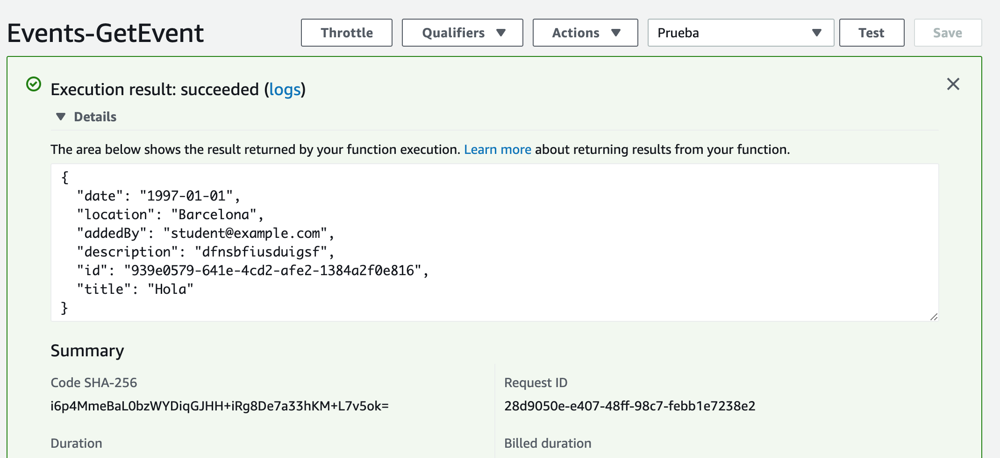

# Probar la función para obtener eventos por id

Creamos un test de prueba cuya entrada es la siguiente:

```json
{
  "id": "939e0579-641e-4cd2-afe2-1384a2f0e816"
}
```
donde,
* **id**: es un id de algún evento creado en la tabla de dynamodb.

Si se ejecuta correctamente, nos devolverá el evento:

<p align="center">
    
</p>


[< Volver al Laboratorio 07 ](../lab-07#crear-endpoint-2) 
