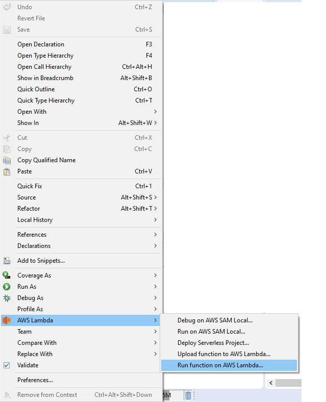

### Crear función ListEvents en eclipse
En eclipse, con el workspace configurado para trabajar con nuestra cuenta de desarrollo de AWS:

1. Creamos un nuevo proyecto de tipo “AWS Lambda Java Project”. Para hacerlo utilizaremos el botón que se ha añadido a la botonera de eclipse al añadir AWS Toolkit y que permite acceder a las funciones que el plugin provee para el desarrollo, despliegue y ejecución de código en AWS.  

<p align="center">
    
</p>

  De las funciones desplegadas al pulsarlo utilizaremos “New AWS Lambda Java Project”.
 
<p align="center">
    
</p>

2. Y especificaremos en el dialogo de opciones:
      * Project Name: EventsAWS.    
      * Group ID: com.accenture.aws
      * Artifact ID: functions
      * Class Name: ListEvents
      * Type: Custom. El tipo de función está determinada por la información que recibe. En nuestro proyecto solo se procesarán peticiones desde el API Gateway, que es el encargado de recibir las peticiones http enviadas desde la aplicación angular. Para estos casos se utiliza el tipo “Custom”.
3. Pulsamos “Finish”. Eclipse generará el proyecto, incluyendo una implementación de ejemplo para nuestra función.

4. Abrimos la clase ListEvents creada y reemplazamos el contenido por:

```java		
package com.accenture.aws.functions;

import java.util.ArrayList;
import java.util.List;
import java.util.Map;

import com.accenture.aws.model.Event;
import com.amazonaws.services.dynamodbv2.AmazonDynamoDB;
import com.amazonaws.services.dynamodbv2.AmazonDynamoDBClientBuilder;
import com.amazonaws.services.dynamodbv2.model.AttributeValue;
import com.amazonaws.services.dynamodbv2.model.ScanRequest;
import com.amazonaws.services.dynamodbv2.model.ScanResult;
import com.amazonaws.services.lambda.runtime.Context;
import com.amazonaws.services.lambda.runtime.RequestHandler;
import com.amazonaws.services.lambda.runtime.events.S3Event;


public class ListEvents implements RequestHandler<S3Event, List<Event>> {

@Override
public List<Event> handleRequest(S3Event event, Context context) {

	System.out.println("Received event: " + event);

	//Definimos el cliente de Dynamodb
	AmazonDynamoDB client = AmazonDynamoDBClientBuilder.standard().build();

	// Creamos la request con el nombre de la tabla
	ScanRequest scanRequest = new ScanRequest()
	    .withTableName("events_XXXX");   

	ScanResult outcome = null;
	try {
		System.out.println("Reading table events...");

		outcome = client.scan(scanRequest);
		System.out.println("Outcome results "+outcome.getItems());
	}
		catch (Exception e) {
		System.err.println("Unable to read table");
		System.err.println(e.getMessage());
	}
	// Transformamos la salida del scan en una lista de eventos
	List<Event> result = new ArrayList<Event>();
	for (Map<String, AttributeValue> item:outcome.getItems()) {
	Event eventItem = new Event(item.get("id").getS(),
			item.get("title").getS(), 
			item.get("date").getS(), 
			item.get("addedBy").getS(), 
			item.get("description").getS(), 
			item.get("location").getS());
	result.add(eventItem);
	}
return result;
}
}
```			
En esta clase, deberemos cambiar el nombre de la tabla "events_XXXX" por el que corresponda con la tabla que hemos creado en DynamoDB.

Vemos que nos da error de compilación proque no encuentra el tipo Event. Para resolverlo:

1. Pinchamos con el botón derecho sobre src/main/java-> New-> Package
	<p align="center">
	    
	</p>

2. Especificamos el nombre del paquete como com.accenture.aws.model

3. Creamos una nueva clase pinchando con el botón derecho sobre el paquete -> New -> Class. Le ponemos el nombre Event y pulsamos "Finish"

4. Una vez creada la clase, reemplazamos su contenido por:

```java		
package com.accenture.aws.model;

public class Event {

private String id;

private String title;

private String date;

private String addedBy;

private String description;

private String location;

public Event() {
}

public Event(String id, String title, String date, String addedBy, String description, String location) {
	super();
	this.id = id;
	this.title = title;
	this.date = date;
	this.addedBy = addedBy;
	this.description = description;
	this.location = location;
}


public String getId() {
	return id;
}

public void setId(String id) {
	this.id = id;
}

public String getTitle() {
	return title;
}

public void setTitle(String title) {
	this.title = title;
}

public String getDate() {
	return date;
}

public void setDate(String date) {
	this.date = date;
}

public String getAddedBy() {
	return addedBy;
}

public void setAddedBy(String addedBy) {
	this.addedBy = addedBy;
}

public String getDescription() {
	return description;
}

public void setDescription(String description) {
	this.description = description;
}

public String getLocation() {
	return location;
}

public void setLocation(String location) {
	this.location = location;
}

@Override
public String toString() {
	return "Event [id=" + id + ", title=" + title + ", date=" + date + ", addedBy=" + addedBy + ", description="
			+ description + ", location=" + location + "]";
}

}
```

:warning:Para quitar los errors de compilación del proyecto, elimina el contenido del paquete **src/test/java**, ya que no vamos a hacer Junits en este openathon:warning:

### Subir la función a AWS

Una vez que tengamos la función ya creada, la debemos subir a AWS.

1. Pulsamos el botón derecho en mitad de la clase,elegimos la opción de menú AWS Lambda -> Upload function to AWS Lambda
	<p align="center">
    
	</p>

2. Selccionamos la clase que acabamos de crear como Handler.
3. Seleccionamos la región en la que creamos el bucket 
4. Creamos una nueva función lambda con el nombre Events-list-XXXX (sustituir por un identificador único).
	<p align="center">
	    
	</p>
5. Pulsamos "Next"
6. En la siguiente pantalla seleccionamos el IAM Role y el bucket que creamos para las funciones lambdas
	<p align="center">
	    
	</p>
7. Pulsamos "Finish"

## Comprobar la creación de la función en AWS desde eclipse

Para comprobar el comportamiento de la función, podemos probarla en AWS desde eclipse.

Para ello, Pulsamos el botón derecho en mitad de la clase,elegimos la opción de menú AWS Lambda -> Run function on AWS Lambda
	<p align="center">
	    
	</p>

En este caso no se envía nada, por lo que dejamos la selección por defecto y pulsamos "Invoke".
	<p align="center">
	    
	</p>

En la consola de eclipse verás la ejecución de la función con el resultado. 

[< Volver al Laboratorio 03 ](../../lab-03)  

