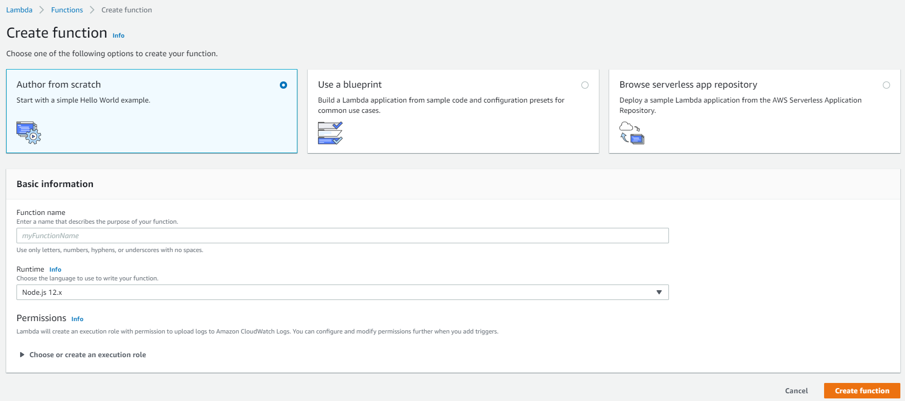
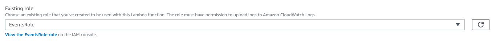
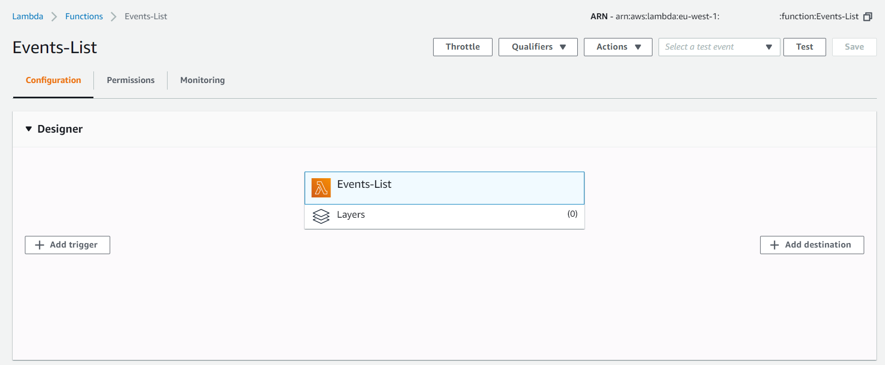

# Get all events - Javascript Version

1.	En la consola de AWS, en el menú Services buscaremos y seleccionaremos **Lambda**.
	> :warning: Hay que verificar que te encuentras en la región correcta. Cada uno de los servicios que se creen en los laboratorios (Cognito, API Gateway, Lambda y DynamoDB) deben pertenecer a la misma región.

2.	Pulsamos *Create Function*.
	<p align="center">
	    
	</p>
3. Dejamos seleccionado *Author from Scatch (crear desde cero)* y en la sección *Basic Information* introducimos:
      * **Function Name:** Events-List_XXXX (utilizar un identificador único).
      * **Runtime:** Node.js 12.x.
      * Pulsamos en *Choose or create an execution role* para expandirlo y marcamos *Use an existing role*, seleccionando el rol  *EventsRole*, que hemos creado previamente (en nuestra cuenta AWS) o que ya existe (si usamos la cuenta de formación). En ambos casos podemos navegar a ver los detalles del rol, y podemos comprobar que tiene asignadas dos políticas de seguridad que determinan lo que la función puede hacer, en este caso utilizar el servicio de logs (para la escritura de trazas de ejecución) y el servicio DynamoDB, para acceder a la tabla "events" que hemos creado previamente.
	<p align="center">
	    
	</p>  
4. Pulsamos *Create Function*. Nuestra función será añadida, aún sin implementación, a la lista de disponibles y se abrirá una ventana de detalle.
	<p align="center">
	    
	</p>  
5. Con la función creada, en la ventana de detalle de la función vamos a incorporar su implementación. Para ello nos desplazamos a la parte inferior de la ventana donde se puede editar su código. Allí reemplazamos el contenido por:

```javascript
/**
 * This lambda function is integrated with the following API methods:
 * /events GET (list operation)
 *
 * Its purpose is to get events from our DynamoDB table
 */

const AWS = require('aws-sdk');
const dynamoDb = new AWS.DynamoDB.DocumentClient();

exports.handler = async (event) => {

    console.log('Initiating Events-ListFunction...');
    console.log(`Received event from API Gateway: ${JSON.stringify(event)}`);
    
    const TableName = 'events_xxxx';
    const { addedBy } = event;
    
    let response;
    try {
        if(addedBy){
            const params = {
                TableName,
                IndexName: "addedBy-index",
                KeyConditionExpression: "#addedBy = :addedBy",
                ExpressionAttributeNames:{
                    "#addedBy": "addedBy",
                },
                ExpressionAttributeValues: {
                    ":addedBy": addedBy
                }
            };
            response = await dynamoDb.query(params).promise();
        } else {
            response = await dynamoDb.scan({TableName}).promise();
        }
    } catch (err) {
        console.log(`${err.code} ${err.message}`);
        console.log('Check your DynamoDB table...');
        
        return {statusCode: err.code, error: err.message};
    }
    console.log('GetItems succeeded');
    console.log(`Received response from DynamoDB: ${JSON.stringify(response)}`);
    return {statusCode: 200, body: JSON.stringify(response)};
};

```
Deberemos cambiar en el código **events_XXXX** por el nombre de la tabla que hemos creado en DynamoDB.

4.	Pulsamos *Save*.


[< Volver al Laboratorio 03 ](../../lab-03)  
